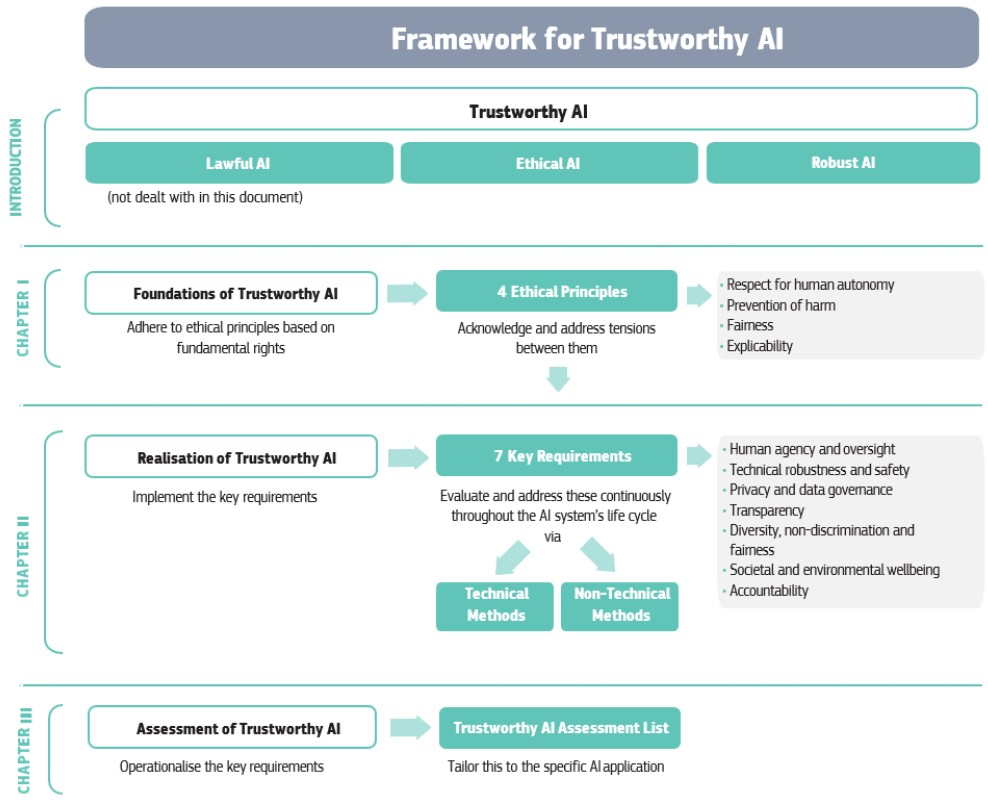
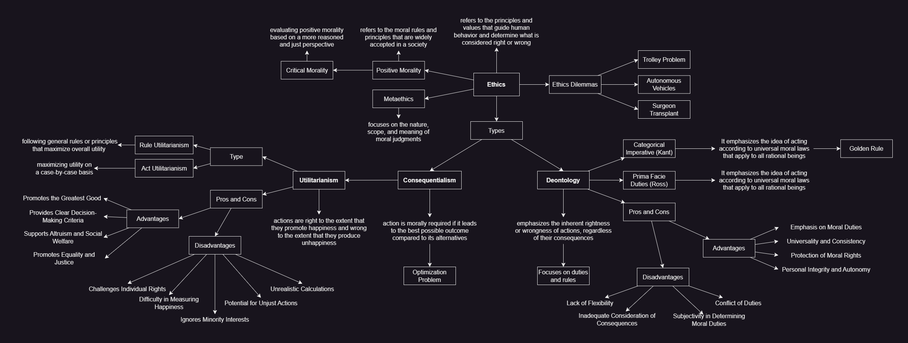

Last Update: 10-06-2023

&nbsp;

**Legenda**

🟩: It seems correct

🟨: To be checked again

🟥: Copied & pasted summary

&nbsp;

**Table of Contents**
- [🟩 Introduction](#-introduction)
- [🟩 Consequentialism](#-consequentialism)
  - [Utilitarianism](#utilitarianism)
  - [Wealth Redistribution](#wealth-redistribution)
  - [Act and Rule Utilitarianism](#act-and-rule-utilitarianism)
  - [Act and Rule Utilitarianism in AI](#act-and-rule-utilitarianism-in-ai)
  - [Popular Ethical Dilemmas](#popular-ethical-dilemmas)
- [🟩 Deontology - Kantian](#-deontology---kantian)
  - [Testing](#testing)
  - [Disadvanges](#disadvanges)
- [🟨 Game Theory](#-game-theory)
  - [Game Theory Framework](#game-theory-framework)
  - [Nash Equilibrium](#nash-equilibrium)
  - [Backward Induction](#backward-induction)
- [🟩 Ethics Guidelines for Trustworthy AI](#-ethics-guidelines-for-trustworthy-ai)
  - [Chapter I](#chapter-i)
  - [Chapter II](#chapter-ii)
- [🟩 Human Right and Information Technology](#-human-right-and-information-technology)
  - [The Universal Declaration of Human Rights](#the-universal-declaration-of-human-rights)
- [🟩 AI, Algorithmic Decision Making, and Big Data: Risks and Opportunities](#-ai-algorithmic-decision-making-and-big-data-risks-and-opportunities)
  - [AI Risks and Benefits](#ai-risks-and-benefits)
  - [Profiling, Influence and Manipulation](#profiling-influence-and-manipulation)
    - [Cambridge Analytica](#cambridge-analytica)
  - [Surveillance Capitalism or Surveillance State?](#surveillance-capitalism-or-surveillance-state)
    - [Surveillance State: the Chinese Social credit systems](#surveillance-state-the-chinese-social-credit-systems)
  - [Individual and Social Cost](#individual-and-social-cost)
  - [Conclusions](#conclusions)
- [🟩 AI in the GDPR](#-ai-in-the-gdpr)
  - [Article 3 - Territorial Scope](#article-3---territorial-scope)
  - [Article 4 - Definitions](#article-4---definitions)
    - [Article 4.1 - Personal data](#article-41---personal-data)
    - [Article 4.2 - Processing](#article-42---processing)
    - [Article 4.4 - Profiling](#article-44---profiling)
    - [Article 4.7 - Controller](#article-47---controller)
    - [Article 4.8 - Processor](#article-48---processor)
    - [Article 4, Recital 26 - Not Applicable to Anonymous Data](#article-4-recital-26---not-applicable-to-anonymous-data)
    - [Article 4.11 - Consent](#article-411---consent)
  - [Article 5 - Data Protection Principle](#article-5---data-protection-principle)
  - [Article 6 - Lawfulness of Processing](#article-6---lawfulness-of-processing)
  - [Article 7 - Condition for Consent](#article-7---condition-for-consent)
  - [Article 9 - Processing of special categories of personal data](#article-9---processing-of-special-categories-of-personal-data)
  - [Article 13-14 - Information to be provided to the data subject](#article-13-14---information-to-be-provided-to-the-data-subject)
  - [Article 17 - Right to Erasure](#article-17---right-to-erasure)
  - [Article 22 - Automated individual decision-making, including profiling](#article-22---automated-individual-decision-making-including-profiling)
    - [Article 22, Recital (71) - A right to explanation](#article-22-recital-71---a-right-to-explanation)
  - [Main issues related to AI](#main-issues-related-to-ai)
    - [Reidentification](#reidentification)
    - [Inference](#inference)
    - [Profiling](#profiling)
- [🟥 Text analytics in the legal domain (Claudette)](#-text-analytics-in-the-legal-domain-claudette)
- [🟥 The Regulation of Online Targeted Advertising: Is Consent Enough?](#-the-regulation-of-online-targeted-advertising-is-consent-enough)
- [🟨 The Ethical Knob: Ethically-Customisable Automated Vehicles and the Law](#-the-ethical-knob-ethically-customisable-automated-vehicles-and-the-law)
  - [Analysis](#analysis)
  - [Conclusions](#conclusions-1)
- [Seminars](#seminars)
  - [🟨 Do Artifacts Have Politics?](#-do-artifacts-have-politics)
    - [Quesitions](#quesitions)
  - [🟥 Responsibility and Automation in Socio-Technical Systems](#-responsibility-and-automation-in-socio-technical-systems)
    - [Questions](#questions)
  - [🟥 Fairness in algorithmic decision making](#-fairness-in-algorithmic-decision-making)
  - [🟥 Algorithmic fairness through group parities The case of COMPAS-SAPMOC — A Lesson to Use of Al in Tax Domain](#-algorithmic-fairness-through-group-parities-the-case-of-compas-sapmoc--a-lesson-to-use-of-al-in-tax-domain)
  - [🟥 AI Ethics at IBM](#-ai-ethics-at-ibm)
- [📊  Summaries](#--summaries)
- [❔ Questions](#-questions)
  - [1. In the context of AI decision-making, what are the key differences between act utilitarianism and rule utilitarianism?](#1-in-the-context-of-ai-decision-making-what-are-the-key-differences-between-act-utilitarianism-and-rule-utilitarianism)
  - [2. What are the challenges associated with implementing act utilitarianism in AI systems that aim to optimize utility on a case-by-case basis?](#2-what-are-the-challenges-associated-with-implementing-act-utilitarianism-in-ai-systems-that-aim-to-optimize-utility-on-a-case-by-case-basis)
  - [3. Discuss the complexities involved in defining a set of rules for AI systems based on rule utilitarianism to maximize overall utility.](#3-discuss-the-complexities-involved-in-defining-a-set-of-rules-for-ai-systems-based-on-rule-utilitarianism-to-maximize-overall-utility)
  - [4. Can you make an example on how AI act utilitarianism and rule utilitarianism from an etical point of view?](#4-can-you-make-an-example-on-how-ai-act-utilitarianism-and-rule-utilitarianism-from-an-etical-point-of-view)
  - [5. How can the values, goals, and societal context influence the determination of the utility function and the type of utilitarianism for AI systems?](#5-how-can-the-values-goals-and-societal-context-influence-the-determination-of-the-utility-function-and-the-type-of-utilitarianism-for-ai-systems)
  - [6. Discuss the trade-offs involved in optimizing utility on a case-by-case basis versus following predefined rules to maximize overall utility in the context of AI decision-making.](#6-discuss-the-trade-offs-involved-in-optimizing-utility-on-a-case-by-case-basis-versus-following-predefined-rules-to-maximize-overall-utility-in-the-context-of-ai-decision-making)
  - [7. Compare and contrast the trolley problem and the social dilemma of autonomous vehicles, highlighting the challenges of consequentialist decision-making in these scenarios.](#7-compare-and-contrast-the-trolley-problem-and-the-social-dilemma-of-autonomous-vehicles-highlighting-the-challenges-of-consequentialist-decision-making-in-these-scenarios)
  - [8. How does Thomson's surgeon case raise moral questions about the utilitarian perspective and the trade-off between saving multiple lives at the cost of one?](#8-how-does-thomsons-surgeon-case-raise-moral-questions-about-the-utilitarian-perspective-and-the-trade-off-between-saving-multiple-lives-at-the-cost-of-one)
  - [9. What is the key difference between deontology and consequentialism in terms of how they evaluate the morality of actions?](#9-what-is-the-key-difference-between-deontology-and-consequentialism-in-terms-of-how-they-evaluate-the-morality-of-actions)
  - [10. How does deontology determine the rightness or wrongness of an action, and what role do consequences play in this framework?](#10-how-does-deontology-determine-the-rightness-or-wrongness-of-an-action-and-what-role-do-consequences-play-in-this-framework)
  - [11. Provide an example of a morally wrong action according to deontology, regardless of its potential positive or negative consequences.](#11-provide-an-example-of-a-morally-wrong-action-according-to-deontology-regardless-of-its-potential-positive-or-negative-consequences)
  - [12. Explain the concept of treating humanity as an end in itself in Kantian ethics and its significance in moral decision-making.](#12-explain-the-concept-of-treating-humanity-as-an-end-in-itself-in-kantian-ethics-and-its-significance-in-moral-decision-making)
  - [13. How does the golden rule relate to the concept of impartiality in ethical decision-making, and what are its limitations?](#13-how-does-the-golden-rule-relate-to-the-concept-of-impartiality-in-ethical-decision-making-and-what-are-its-limitations)
  - [14. Describe Immanuel Kant's principle of universalizability and its role in determining the morality of an action.](#14-describe-immanuel-kants-principle-of-universalizability-and-its-role-in-determining-the-morality-of-an-action)
  - [15. What does it mean for a maxim to be morally right according to Kantian ethics, and how is it tested through the principle of universalizability?](#15-what-does-it-mean-for-a-maxim-to-be-morally-right-according-to-kantian-ethics-and-how-is-it-tested-through-the-principle-of-universalizability)
  - [16. Can you provide an example of testing the universalizability of a maxim and explaining why it would be considered morally wrong?](#16-can-you-provide-an-example-of-testing-the-universalizability-of-a-maxim-and-explaining-why-it-would-be-considered-morally-wrong)
  - [17. What criticisms or limitations are often raised against deontological ethics, particularly its rigidity and inflexibility?](#17-what-criticisms-or-limitations-are-often-raised-against-deontological-ethics-particularly-its-rigidity-and-inflexibility)
  - [18. How might cultural relativism challenge the universality of moral norms and principles proposed by deontology?](#18-how-might-cultural-relativism-challenge-the-universality-of-moral-norms-and-principles-proposed-by-deontology)
  - [19. Discuss the potential implications of deontological ethics in real-life scenarios where context and consequences are important factors to consider.](#19-discuss-the-potential-implications-of-deontological-ethics-in-real-life-scenarios-where-context-and-consequences-are-important-factors-to-consider)
  - [20. Can deontological ethics be reconciled with consequentialist considerations in certain situations, or are they fundamentally incompatible?](#20-can-deontological-ethics-be-reconciled-with-consequentialist-considerations-in-certain-situations-or-are-they-fundamentally-incompatible)
  - [21. What is game theory?](#21-what-is-game-theory)
  - [22. What's the Nash Equilibrium?](#22-whats-the-nash-equilibrium)
  - [23. Can you provide an example of a game in game theory?](#23-can-you-provide-an-example-of-a-game-in-game-theory)
  - [24. How does game theory apply to strategic decision-making?](#24-how-does-game-theory-apply-to-strategic-decision-making)
  - [25. Are there any limitations or criticisms of game theory?](#25-are-there-any-limitations-or-criticisms-of-game-theory)
  - [26. Explain the concept of backward induction and its role in determining optimal choices in sequential decision-making scenarios.](#26-explain-the-concept-of-backward-induction-and-its-role-in-determining-optimal-choices-in-sequential-decision-making-scenarios)
  - [27. What are the three fundamental requirements for ensuring trustworthy AI according to the "Ethics Guidelines for Trustworthy AI" document?](#27-what-are-the-three-fundamental-requirements-for-ensuring-trustworthy-ai-according-to-the-ethics-guidelines-for-trustworthy-ai-document)
  - [28. Who prepared the "Ethics Guidelines for Trustworthy AI" document, and what is its purpose?](#28-who-prepared-the-ethics-guidelines-for-trustworthy-ai-document-and-what-is-its-purpose)
  - [29. How are the guidelines divided in terms of chapters, and what do they cover?](#29-how-are-the-guidelines-divided-in-terms-of-chapters-and-what-do-they-cover)
  - [30. Who are the intended users of these guidelines, and why are they considered important for compliance?](#30-who-are-the-intended-users-of-these-guidelines-and-why-are-they-considered-important-for-compliance)
  - [31. How do the guidelines address the ethical implications of AI and promote fundamental rights?](#31-how-do-the-guidelines-address-the-ethical-implications-of-ai-and-promote-fundamental-rights)
  - [32. What are the four ethical principles derived from human rights that should guide the development, deployment, and use of AI systems?](#32-what-are-the-four-ethical-principles-derived-from-human-rights-that-should-guide-the-development-deployment-and-use-of-ai-systems)
  - [33. What does the principle of human agency and oversight entail, and why is it important in the context of AI systems?](#33-what-does-the-principle-of-human-agency-and-oversight-entail-and-why-is-it-important-in-the-context-of-ai-systems)
  - [34. How does the guideline emphasize the importance of technical robustness, safety, and accuracy in AI systems?](#34-how-does-the-guideline-emphasize-the-importance-of-technical-robustness-safety-and-accuracy-in-ai-systems)
  - [35.  What are the key considerations regarding privacy, data governance, and transparency in AI systems?](#35--what-are-the-key-considerations-regarding-privacy-data-governance-and-transparency-in-ai-systems)
  - [36. How does the guideline promote diversity, non-discrimination, fairness, societal well-being, and accountability in AI development and use?](#36-how-does-the-guideline-promote-diversity-non-discrimination-fairness-societal-well-being-and-accountability-in-ai-development-and-use)
  - [37. What is the purpose of normative knowledge in the context of information technologies?](#37-what-is-the-purpose-of-normative-knowledge-in-the-context-of-information-technologies)
  - [38. What are the key principles of trustworthy AI?](#38-what-are-the-key-principles-of-trustworthy-ai)
  - [39. How does AI4 People emphasize the relationship between technology and human development?](#39-how-does-ai4-people-emphasize-the-relationship-between-technology-and-human-development)
  - [40. How do information and communication technologies impact human rights?](#40-how-do-information-and-communication-technologies-impact-human-rights)
  - [41. What is the Universal Declaration of Human Rights?](#41-what-is-the-universal-declaration-of-human-rights)
  - [42. How many articles are there in the Universal Declaration of Human Rights?](#42-how-many-articles-are-there-in-the-universal-declaration-of-human-rights)
  - [43. What are some examples of human rights mentioned in the Universal Declaration of Human Rights?](#43-what-are-some-examples-of-human-rights-mentioned-in-the-universal-declaration-of-human-rights)
  - [44. What is the importance of the right to privacy?](#44-what-is-the-importance-of-the-right-to-privacy)
  - [45. How does the right to an adequate standard of living relate to human well-being?](#45-how-does-the-right-to-an-adequate-standard-of-living-relate-to-human-well-being)
  - [46. What is the significance of the right to education?](#46-what-is-the-significance-of-the-right-to-education)
  - [47. What are the potential benefits of AI, Algorithmic Decision Making, and Big Data?](#47-what-are-the-potential-benefits-of-ai-algorithmic-decision-making-and-big-data)
  - [48. What are the risks and challenges associated with advancements in AI and Big Data?](#48-what-are-the-risks-and-challenges-associated-with-advancements-in-ai-and-big-data)
  - [49. How can profiling, influence, and manipulation occur in the era of AI?](#49-how-can-profiling-influence-and-manipulation-occur-in-the-era-of-ai)
  - [50. What are the ethical concerns raised by the Cambridge Analytica scandal?](#50-what-are-the-ethical-concerns-raised-by-the-cambridge-analytica-scandal)
  - [51. What is the Surveillance State, and how does it relate to Surveillance Capitalism?](#51-what-is-the-surveillance-state-and-how-does-it-relate-to-surveillance-capitalism)
  - [52. What are the concerns associated with the Chinese Social credit system?](#52-what-are-the-concerns-associated-with-the-chinese-social-credit-system)
  - [53. What are the individual and social costs associated with AI and Big Data applications?](#53-what-are-the-individual-and-social-costs-associated-with-ai-and-big-data-applications)
  - [54. What is the purpose of GDPR?](#54-what-is-the-purpose-of-gdpr)
  - [55. What are the key principles of GDPR?](#55-what-are-the-key-principles-of-gdpr)
  - [56. What rights do individuals have under GDPR?](#56-what-rights-do-individuals-have-under-gdpr)
  - [57. What are the responsibilities of data controllers under GDPR?](#57-what-are-the-responsibilities-of-data-controllers-under-gdpr)
  - [58. How does GDPR impact consent for data processing?](#58-how-does-gdpr-impact-consent-for-data-processing)
  - [62. How does GDPR address the handling of data breaches?](#62-how-does-gdpr-address-the-handling-of-data-breaches)
  - [63. Does GDPR only apply to European organizations?](#63-does-gdpr-only-apply-to-european-organizations)

&nbsp;

&nbsp;

# 🟩 Introduction

**Morality** or **ethics** refers to the principles and values that guide human behavior and determine what is considered right or wrong. When making decisions or evaluating the actions of others, individuals can take either a self-interested perspective, focusing on their own particular interests, or they can be motivated by the belief that an action is morally right, regardless of its impact on their self-interest. Morality is influenced by social norms and is often learned through socialization processes within a society. People absorb the moral standards considered obligatory in their society and make them their own. This raises the question of whether morality is solely a matter of social learning and imitation. Can individuals develop a critical attitude toward their society's morality? And if so, what is the basis for this critical attitude-reason or intuition?

**Positive morality**, also known as **conventional morality**, refers to the moral rules and principles that are widely accepted in a society. These include social norms, cultural values, and legal regulations. However, it is important to question whether positive morality can be inherently bad or flawed.

**Critical morality**, on the other hand, involves evaluating positive morality based on a more reasoned and just perspective. It takes into account individual and social interests, giving due significance to factors such as harm to others, impacts on the environment, and other ethical considerations. Critical morality allows for the criticism and examination of societal norms and practices, acknowledging that critiques can be either right or wrong. For example, feminist critiques against patriarchy or Nazi criticism against compassion can be seen as instances of critical morality.

When it comes to AI systems, there is a debate about whether they should learn and adopt social morality as it exists or if they should develop a critical attitude toward it. Should AI systems simply imitate and follow the norms of human societies, or should they be capable of questioning and challenging those norms?

**Ethics** and **metaethics** are two branches of moral philosophy. Normative ethics deals with determining what actions are morally required and how individuals ought to behave. Metaethics, on the other hand, focuses on the nature, scope, and meaning of moral judgments. It investigates questions such as whether ethical judgments can be true or false.

To understand the difference between ethical judgments, consider the following examples:

1. "I prefer vegetables to meat": This statement expresses a personal preference or taste, which is subjective and not necessarily tied to moral considerations.
2. "I ought to eat more vegetables to be more healthy": This statement presents a moral obligation based on the individual's health and well-being. It implies a moral imperative to act in a certain way.
3. "We ought to become vegetarians": This statement goes beyond personal preference or individual health and asserts a moral obligation for a larger group or society to adopt a particular behavior. It implies a moral duty that applies to everyone.

The question of whether ethical judgments correspond to facts in the world is a topic of ongoing philosophical debate. **Some argue that ethical judgments are based on rationality, while others contend that they are rooted in subjective feelings or sentiments**. Different moral philosophers have proposed various perspectives, such as David Hume's view that morality is a matter of sentiment and Emmanuel Kant's belief that moral truths can be known through reason. David Ross, for instance, suggests that moral knowledge comes from intuition.

The debate revolves around whether there is a single true ethics or if ethical judgments are always relative to specific frameworks of attitudes:

- **Absolutists** believe that there is an objective moral truth, and conflicting ethical judgments cannot both be correct.
- **Relativists**, on the other hand, argue that ethical judgments are subjective and vary depending on cultural, social, or individual perspectives. They believe that a statement like "abortion is morally permissible" may be true within one framework but false within another.

Gilbert Harman's example highlights a scenario where an individual may judge an action as great evil but still find it challenging to determine whether it was morally wrong. This illustrates the complexity and disagreement that can arise even when evaluating morally significant events.

Morality often involves widespread disagreement, as seen in contentious issues like abortion, migration, capital punishment, and humanitarian wars. However, there are certain moral principles that many people tend to agree on, such as the belief that it is wrong to kill innocent people, lie, or harm others.

Moral judgments can be either **pro-tanto** or **all-things-considered**. Pro-tanto moral judgments state general principles that can have exceptions. For example, the principle "we should not lie" can be outweighed by other moral reasons when, for instance, telling a lie could save a person's life. It raises the question of whether robotic agents should consider their duties as defeasible or subject to exceptions. David Ross provides an example of breaking an engagement to prevent a serious accident, highlighting the importance of weighing moral reasons in specific contexts.

Morality intersects with other normative systems, such as law, religion, tradition, and self-interest. Positive or critical morality may include laws enforced by the state, but it is debatable whether it encompasses all laws or only specific ones. Similarly, critical morality's inclusion of religious commands raises questions about the relationship between divine commands and moral obligations. The moral status of atheists and the comparison between religious and atheistic societies in terms of morality are also matters of discussion. Additionally, the conflict between self-interest and morality arises, questioning whether individuals should only act in ways that serve their personal interests.

&nbsp;

&nbsp;

# 🟩 Consequentialism

The concept of consequentialism revolves around the idea that an **action is morally required if it leads to the best possible outcome compared to its alternatives**. In other words, if the positive outcomes outweigh the negative outcomes to the greatest extent and if it **produces the highest utility**, then the action is considered morally required. Consequentialism treats morality as an **optimization problem, where the goal is to maximize the good and minimize the bad**. There are various kinds of consequentialism, each addressing questions such as what things should be maximized, how many of them there are, how much each matters, and whether a single utility function can combine gains and losses across multiple valuable goals.

&nbsp;

## Utilitarianism

One prominent version of consequentialism is **Utilitarianism**, which was developed by philosophers Jeremy Bentham and John Stuart Mill. Utilitarianism is based on the principle of utility, stating that **actions are right to the extent that they promote happiness and wrong to the extent that they produce unhappiness**. Happiness, in this context, refers to pleasure and the absence of pain. Utility is associated with the satisfaction of desires or interests, and utilitarianism considers the utility of all individuals equally, making it an egalitarian approach.

Utilitarianism has several advantages: 
- It is conceptually simple, treating everyone's utility equally and aligning with the intuitive notion that making people happy is good while causing suffering is bad.
- It often provides workable solutions, although it can be problematic in certain cases, such as addressing hunger or determining how to treat friends and relatives.

&nbsp;

## Wealth Redistribution

One aspect to consider is whether it is acceptable to take actions that benefit some individuals at the expense of others, as long as the overall benefits outweigh the disadvantages. **Utilitarianism often supports modest wealth redistribution because it suggests that providing the same amount of money to the poor generates more utility for them compared to the utility gained by the rich.** By redistributing wealth, utilitarianism aims to reduce overall suffering and promote a more equitable society.

For example, suppose there is a society with extreme income inequality, where a small fraction of the population possesses a significant portion of the wealth while the majority struggles to meet their basic needs. From a utilitarian perspective, redistributing some wealth from the rich to the poor can lead to a more significant increase in overall happiness or well-being. The poor, who are in dire need, would experience a substantial boost in utility, even if the rich experience a relatively smaller decrease in utility due to the redistribution.

However, the impact of redistribution on wealth generation and societal prosperity needs to be considered as well. Critics of extensive wealth redistribution argue that it may disincentivize innovation, entrepreneurship, and wealth creation. **They contend that if individuals and businesses are heavily taxed or discouraged from accumulating wealth, the motivation to take risks, invest, and generate economic growth may diminish.** This perspective aligns with wealth maximization approaches, which prioritize overall wealth accumulation and economic prosperity without focusing on distribution.

For instance, proponents of wealth maximization argue that by allowing individuals and businesses to amass significant wealth, they can contribute to economic growth, job creation, and innovation, ultimately benefiting society as a whole. They emphasize the importance of creating an environment conducive to wealth generation and entrepreneurship, where individuals are incentivized to take risks and invest their resources.

To illustrate further, let's consider a scenario where a government is contemplating tax policies. Utilitarianism might advocate for higher taxes on the wealthy to fund social programs and support the less fortunate. This redistribution of wealth could alleviate poverty, improve access to education and healthcare, and enhance overall well-being, particularly for the disadvantaged segments of society.

In contrast, a wealth maximization approach would prioritize lower taxes and fewer regulations, aiming to create an environment that encourages wealth creation and investment. Proponents argue that by allowing individuals and businesses to retain a larger portion of their wealth, they can reinvest it, stimulate economic growth, and generate opportunities that benefit society as a whole. The focus is on fostering economic prosperity and maximizing the overall wealth of the society, regardless of the distribution.

Ultimately, **the question of distribution and the balance between wealth redistribution and wealth maximization involves a trade-off between promoting overall well-being and fostering economic growth**. It requires careful consideration of the specific context, societal values, and the potential consequences of different approaches.

&nbsp;

## Act and Rule Utilitarianism

There are two versions of utilitarianism:
- **Act utilitarianism** focuses on maximizing utility (i.e., overall well-being or happiness) on a case-by-case basis. According to act utilitarianism, the morally right action is the one that produces the greatest amount of utility in a specific situation, regardless of any pre-established rules or principles.
- On the other hand, **Rule utilitarianism** emphasizes following general rules or principles that, when consistently applied, maximize overall utility. Rule utilitarianism considers the long-term consequences of adopting certain rules or principles and aims to promote the greatest amount of utility over a broader range of situations.

&nbsp;

## Act and Rule Utilitarianism in AI

Now, when it comes to AI systems, the question arises as to whether they should **mimic the role of Archangels** (act utilitarians) **or Proles** (rule utilitarians). **Should AI systems make decisions on a case-by-case basis, optimizing utility in each individual scenario, or should they follow pre-established rules and principles that maximize utility in a more general sense?**:

- Determining the utility function and the level of information required for decision-making poses challenges for both human decision-makers and AI systems. For example, if an AI system is programmed with **act utilitarianism**, it needs to have access to detailed information about each specific situation to calculate the potential outcomes and assess the utility. This can be challenging, as some situations may involve uncertain or incomplete information.
- On the other hand, if an AI system follows **rule utilitarianism**, it needs a set of predefined rules that have been determined to maximize overall utility. However, defining these rules and ensuring they cover a wide range of scenarios while avoiding conflicts or contradictions can be complex.

To illustrate this further, let's consider an example: **Suppose an AI system is responsible for managing traffic flow in a city.** 
- If it adopts **act utilitarianism**, it would make decisions on a case-by-case basis, aiming to minimize traffic congestion and maximize overall efficiency in each situation. This might involve dynamically adjusting traffic signal timings based on real-time data. However, this approach may lead to situations where individual drivers or pedestrians are inconvenienced or experience delays.
- Alternatively, if the AI system follows **rule utilitarianism**, it would adhere to predefined traffic rules that have been designed to optimize traffic flow and safety in a more general sense. It would prioritize the overall utility of the traffic system, even if some specific instances might not yield the maximum utility.

In this example, the choice between act utilitarianism and rule utilitarianism for the AI system depends on various factors, such as the values of the city's residents, traffic regulations, and the level of control the AI system has over the traffic infrastructure.

Overall, **determining the utility function and the type of utilitarianism for AI systems involves weighing the trade-offs between optimizing utility on a case-by-case basis versus following predefined rules that aim to maximize overall utility**. It requires careful consideration of the specific context, values, and goals of the AI system and the society it operates in.

&nbsp;

## Popular Ethical Dilemmas

The "**trolley problem**" is a thought experiment that exemplifies the challenges of consequentialist decision-making. **It presents a scenario where a person must decide whether to divert a runaway trolley to a track where it will kill one person instead of continuing on a track where it will kill five people**. The question of what one should do and what an AI system tasked with monitoring traffic should do demonstrates the complexity of ethical decision-making in consequentialist frameworks.

Another ethical dilemma arises in the context of autonomous vehicles, known as the social dilemma of autonomous vehicles. Researchers like Bonnefon et al. (2016) have explored scenarios where **autonomous vehicles face situations where they must make decisions that could potentially harm some individuals to save others**. These scenarios highlight the challenges of applying consequentialist principles to real-world situations.

Finally, Judith Jarvis Thomson's surgeon case presents a moral dilemma where a **transplant surgeon has the opportunity to save five dying patients by killing a healthy young traveler who is compatible with their organs**. The question is whether the surgeon's actions can be justified from a utilitarian perspective, considering the overall utility gained by saving five lives at the cost of one.

&nbsp;

&nbsp;

# 🟩 Deontology - Kantian

**Deontology**, also known as **Kantian ethics**, is a moral framework that **emphasizes the inherent rightness or wrongness of actions, regardless of their consequences**. It is contrasted with consequentialism, which evaluates actions based on the outcomes they produce.

In deontology, certain **actions are considered intrinsically good or bad**, regardless of the consequences they bring about. For example, lying is viewed as morally wrong in deontology, regardless of whether it leads to positive or negative effects. The focus is on the ethical principles or moral norms that determine the rightness or wrongness of an action.

Deontologists believe that the rightness of an action is determined by its conformity to moral norms, rather than its consequences. This means that **even if an action could lead to greater overall utility or happiness, it may still be considered wrong if it violates a moral norm**. For instance, deontologists argue that killing someone is always wrong, even if it would bring about more utility in a particular situation.

The deontological perspective places priority on the rightness or wrongness of actions over the pursuit of the good or desirable outcomes. This means that a morally right choice is one that aligns with a moral norm or principle, regardless of the potential positive or negative effects it may have. For example, even if killing someone would bring about greater utility, a deontologist would argue that it is still morally wrong because it violates the moral norm against killing.

Kant's ethics also emphasize the concept of treating humanity as an end in itself, rather than merely as a means to an end. This principle of humanity requires treating individuals with dignity and respect, considering their values and purposes, and not using them solely as instruments for one's own goals.

&nbsp;

## Testing

The concept of **impartiality** is closely linked to ethics. Deontologists consider ethics to be connected to ideas of fairness and impartiality. The **golden rule**, which states that one should treat others as they would like to be treated, is often seen as a guiding principle of impartiality in ethical decision-making. It emphasizes the importance of treating others with respect and fairness. However, the application of the golden rule may not always be straightforward or universally applicable. There can be situations where following the golden rule may lead to undesirable outcomes or conflicts of interest. For example, if someone wishes to be treated in a harmful or unethical manner, following the golden rule would not necessarily be considered morally right.

Immanuel Kant, one of the most influential philosophers, developed the concept of deontological ethics. Kant believed that moral actions are guided by reason and universal principles. He proposed the principle of universalizability, which states that one should act only according to the maxim (intention or principle) that they could will to become a universal law. This means that **an action should be morally right if everyone could act upon the same principle without contradiction**.

To test the universalizability of a maxim, one can imagine a world in which everyone follows that maxim and ask if the goal of the action could still be achieved. If the goal is impossible to achieve in such a world or if it leads to contradiction or inconsistency, the maxim is considered morally wrong.

&nbsp;

## Disadvanges

While deontology provides a strong framework for moral decision-making, it also has its limitations and criticisms. Some argue that it can be **too rigid and inflexible**, failing to consider the context and consequences of actions. Others question the universality of moral norms and principles, suggesting that they may vary across cultures and individuals.

&nbsp;

&nbsp;

# 🟨 Game Theory

**Game theory is a field that analyzes the strategic interactions between rational decision-makers**. It has applications in various disciplines, including economics, political science, and law. In the context of law, game theory provides a framework to understand and analyze how legal actors, such as judges, lawyers, and litigants, make decisions and interact with each other. In the usual framework used by economists, an agent is faced with a set of alternatives from which they must choose. These alternatives can be represented as $X = x_1, x_2, ..., x_n,$ for example, a set of fruits like "Big apple" "Small apple" and "Pear" The agent has a preference relation represented by the symbol \"$\gtrsim$\" (read as "is weakly preferred to"). For instance, $x_i$ $\gtrsim$ $x_j$ means that $x_i$ is at least as valuable or desired as $x_j$. We can also use the notation $x_i$ $\ge$ $x_j$ to represent the same relationship, and $x_i \ge x_j$ to represent strict preference ($x_i$ is strictly preferred to $x_j$).

Certain assumptions are typically made regarding these preference relations: 
- The first assumption is **reflexivity**, which states that every alternative is as valuable as itself ($x_i \gtrsim x_i$ for any alternative $x_i$). 
- The second assumption is **completeness**, which means that all alternatives are comparable ($x_i \gtrsim x_j or x_j \gtrsim x_i$ for any alternatives $x_i$ and $x_j$). In other words, one alternative must be at least as valuable as the other. 
- *Transitivity* is another assumption, stating that if $x_i \gtrsim x_j$ and $x_j \gtrsim x_k, then $x_i \gtrsim x_k$. 
- Finally, **continuity** is often assumed, but not always, which deals with the continuity of preferences and the ability to make small adjustments to them.

To quantify preferences, economists often use utility functions. These functions assign numbers to alternatives to reflect the ordering of preferences. A utility function $u(x)$ associates a number to each element $x$ in $X$, such that for any $u(x_i)$ and $u(x_j)$, $u(x_i)$ $\gtrsim$ $u(x_j)$ if and only if $u(x_i)$ $\ge$ $u(x_j)$. In simpler terms, if an apple is strictly preferred to a pear, then the number associated with the apple must be greater than the number associated with the pear.

**Rationality in decision-making requires that a person chooses their most preferred option**, i.e., the option with the highest utility. A person is considered rational if their choices reveal a consistent preference relationship that satisfies the axioms of reflexivity, completeness, and transitivity. However, there is ongoing debate about whether utility maximization is necessary, sufficient, or even compatible with rationality. Some argue that rationality should also involve reasoned scrutiny and may be broader or incompatible with utility maximization in certain contexts.

&nbsp;

## Game Theory Framework

The framework of game theory is a **mathematical and strategic analysis tool used to study decision-making and interactions among multiple players**. Let's break down the components mentioned in the text:

1. **Players**: The framework starts with a finite set of players denoted as N. In the given examples, the players are represented as "Row" and "Col" or "Consumer" and "Producer." These players are the entities involved in the game, each with their own decision-making capabilities.
2. **Strategies**: For each player i, there is a set of alternative strategies or actions denoted as Ai. In the examples provided, "Row" and "Col" can choose between "flic" and "floc" actions, while "Consumer" and "Producer" can choose between "violate" and "¬violate" (not violate) or "protect" and "¬protect" (not protect) actions, respectively.
3. **Payoff Function**: Each player i has a payoff function, which represents their preferences or utility over the different combinations of actions taken by all players (referred to as action profiles). The action profiles cover all possible combinations of actions from the players. In the given example, the payoff function for player "Row" is shown with specific values assigned to each combination of actions taken by "Row" and "Col."

   - uRow(flicRow, flicCol) = 1: If "Row" chooses "flic" and "Col" chooses "flic," the payoff (utility) for "Row" is 1.
   - uRow(flicRow, flocCol) = 0: If "Row" chooses "flic" and "Col" chooses "floc," the payoff for "Row" is 0.
   - uRow(flocRow, flicCol) = 0: If "Row" chooses "floc" and "Col" chooses "flic," the payoff for "Row" is 0.
   - uRow(flocRow, flocCol) = 1: If "Row" chooses "floc" and "Col" chooses "floc," the payoff for "Row" is 1.

**These payoff values represent the preferences or benefits that each player receives based on the chosen combination of actions**. The specific values assigned to the payoff function may vary depending on the specific game being analyzed.

|         | flicCol | flocCol |
|---------|---------|---------|
| flicRow |    1    |    0    |
| flocRow |    0    |    1    |

In our case players have those preferences:

(flicCol, flicRow) $\approx_R$ (flocCol, flocRow) $\gtrsim_R$ (flocCol, flicRow) $\approx_R$ (flicCol, flicRow)

(flicCol, flicRow) $\approx_C$ (flocCol, flocRow) $\gtrsim_C$ (flocCol, flicRow) $\approx_C$ (flicCol, flicRow)

&nbsp;

## Nash Equilibrium

Nash equilibrium is a concept in game theory that represents a **stable state in a game where no player has an incentive to unilaterally deviate from their chosen strategy, given the strategies chosen by all other players**.

To find the Nash equilibrium in a game, one would have to model out each of the possible scenarios to determine the results and then choose what the optimal strategy would be. In a two-person game, this would take into consideration the possible strategies that both players could choose. **If neither player changes their strategy knowing all of the information, a Nash equilibrium has occurred**.

Let's consider an example of a simple game between two players: Player A (Row) and Player B (Column). Each player has two available strategies: "Cooperate" (C) and "Defect" (D). The payoffs for each player in the game are as follows:

|    A\B    | Cooperate (C) | Defect (D)    |
|---------|---------------|---------------|
| Cooperate (C) | 3, 3          | 0, 5          |
| Defect (D)    | 5, 0          | 1, 1          |

To find the Nash equilibrium, we need to **identify the strategies where neither player has an incentive to switch**. In this case, the Nash equilibrium occurs when both players choose the "Defect" strategy (D). This is because if Player A chooses "Cooperate" (C), Player B's best response is to choose "Defect" (D) to maximize their own payoff. Similarly, if Player B chooses "Cooperate" (C), Player A's best response is to choose "Defect" (D). Since the strategy are:

(A Defect, B Cooperate) $\gtrsim_A$ (A Cooperate, B Cooperate) $\gtrsim_A$ (A Defect, B Defect) $\gtrsim_A$ (A Cooperate, B Defect)

(A Cooperate, B Defect) $\gtrsim_B$ (A Cooperate, B Cooperate) $\gtrsim_B$ (A Defect, B Defect) $\gtrsim_B$ (A Defect, B Cooperate)

Therefore, **(D, D) is the Nash equilibrium** in this game since no player has an incentive to unilaterally deviate from their strategy, given the strategy chosen by the other player.

&nbsp;

Let's consider another example of a game between two cars at an intersection, the payoff matrix represents the outcomes for each possible combination of actions. The actions available to each car are "Go" or "Stop" and the numbers in the matrix represent the payoffs (or utilities) received by Car A and Car B for each combination of actions.

Let's analyze the matrix:

|    A\B    | Go | Stop    |
|---------|---------------|---------------|
| Go | -5, -5          | 1, 0          |
| Stop    | 0, 1          | -1, -1          |

In this matrix:
- If both cars choose to "Go," they both receive a payoff of -5. This outcome is suboptimal for both cars since they would prefer a higher payoff.
- If Car A chooses to "Go" while Car B chooses to "Stop," Car A receives a payoff of 1, and Car B receives a payoff of 0.
- If Car A chooses to "Stop" while Car B chooses to "Go," Car A receives a payoff of 0, and Car B receives a payoff of 1.
- If both cars choose to "Stop," they both receive a payoff of -1.

To find the Nash equilibria, we need to identify the combinations of actions where neither car has an incentive to unilaterally change their strategy. In other words, they are in a stable state.

Looking at the matrix, we can observe **two Nash equilibria**:
1. **(Go, Stop)**: If Car A chooses "Go" and Car B chooses "Stop," neither car has an incentive to change their action. Car A receives a payoff of 1, which is better than any other option when Car B stops. Car B receives a payoff of 0, which is also better than any other option when Car A goes.
2. **(Stop, Go)**: If Car A chooses "Stop" and Car B chooses "Go," neither car has an incentive to change their action. Car A receives a payoff of 0, which is better than any other option when Car B stops. Car B receives a payoff of 1, which is also better than any other option when Car A stops.

In both cases, neither car can improve their payoff by unilaterally changing their action, leading to stable outcomes. Therefore, there are indeed two Nash equilibria in this game: (Go, Stop) and (Stop, Go).

&nbsp;

## Backward Induction

Backward induction is a **reasoning process that starts from the end of a sequential decision-making scenario and works backward to determine the optimal choices at each stage**. It is commonly used in game theory to analyze strategic interactions between players.

Let's consider a classic example known as the "Centipede game". In this game, two players, Player 1 and Player 2, take turns deciding whether to continue or stop. The game begins with a pot of money that grows at each step. If Player 1 continues, the pot doubles, and Player 2 can either continue or stop. If Player 2 continues, the pot doubles again, and the game continues. However, if either player chooses to stop, the game ends, and the players split the money in the pot.

To analyze this game using backward induction, we start from the last decision point, which is when the pot has reached its maximum value. At this point, Player 2, who is making the final decision, has an incentive to stop and claim their share of the money rather than continuing. Player 1, anticipating this, realizes that continuing will result in a smaller payoff, so they also have an incentive to stop at the previous stage.

Following this backward reasoning, we conclude that both players should stop at every decision point, and the game ends with an equal split of the pot. By working backward and considering the consequences of each choice, we can determine the optimal strategy in this sequential game.

Backward induction can also be applied to more complex scenarios, such as multi-stage negotiations, business strategies, or even long-term planning, where considering the future consequences of decisions is crucial for determining the best course of action.

&nbsp;

&nbsp;

# 🟩 Ethics Guidelines for Trustworthy AI

**The "Ethics Guidelines for Trustworthy AI" document**, prepared by the High-Level Expert Group on Artificial Intelligence set up **by the European Commission**, provides comprehensive guidelines for **ensuring the ethical and responsible development and use of AI systems**. The idea of trustworthy AI is based on three fundamental requirements: **AI should be lawful, ethical, and robust.** These requirements should be met throughout the entire life cycle of an AI system. However, it is essential to acknowledge that AI systems can also have unintended harmful effects, even with good intentions.

The document is **divided into three chapters**. The first chapter establishes ethical principles for developing and utilizing AI systems. The second chapter offers guidance on attaining trustworthy AI through seven key requirements. The third chapter introduces the concept of a Trustworthy AI assessment list to be employed throughout the development and utilization of AI systems.

**These guidelines are voluntary and can be used to operationalize the commitment to achieving Trustworthy AI**. They are applicable to various entities, including companies, organizations, researchers, public services, government agencies, and civil society organizations. The guidelines emphasize the importance of compliance with existing laws and regulations, both at the European Union (EU) level and within individual EU member states. They highlight the role of AI ethics in addressing the ethical implications of AI, such as promoting human dignity, individual freedom, democracy, justice, equality, and non-discrimination. The guidelines also recognize other fundamental rights, including the right to privacy, freedom of expression, and access to public documents.

&nbsp;

&nbsp;

## Chapter I

**Ethical principles that should guide the development, deployment, and use of AI systems**. Based on human rights, there are four ethical principles that are commonly derived: 

- **Respect for human autonomy** ensures that individuals maintain control over themselves and participate in democratic processes when interacting with AI systems. AI should empower and complement human skills, avoiding coercion or manipulation. Human-centric design principles should guide the allocation of functions between humans and AI, allowing for meaningful human choice and meaningful work.
- **Prevention of harm** emphasizes that AI systems should not cause harm or negatively impact human well-being. Protection of human dignity and physical and mental integrity is essential. AI systems and their environments must prioritize safety and security.
- **Fairness** encompasses both substantive and procedural dimensions. Substantively, AI systems should promote equal distribution of benefits and avoid unfair bias or discrimination. Equal opportunity for education, access to goods, services, and technology should be ensured. Procedurally, individuals should have the ability to contest decisions made by AI systems, and the decision-making processes should be explicable. The principle of proportionality and balancing competing interests should guide AI practitioners.
- **Explicability** is crucial for contestability and transparency. AI processes should be transparent, and the capabilities and purpose of AI systems should be openly communicated. While complete explanations may not always be possible, other measures like traceability, auditability, and transparent communication on system capabilities may be necessary. The level of explicability required depends on the context and potential consequences of erroneous or inaccurate outputs.

&nbsp;

## Chapter II

**Guidance on realizing trustworthy AI**.The chapter outline seven key requirements that AI systems should meet in order to be considered trustworthy:
   - **Human agency and oversight** play a crucial role in the development and use of AI systems. They should support human autonomy, fundamental rights, and human rights assessments. Users should have the ability to make informed autonomous decisions, while human oversight ensures that AI systems do not undermine human autonomy or cause adverse effects. Technical robustness and safety are essential, with a focus on preventing harm and minimizing risks.
   - **Technical robustness and safety** is another important aspect. AI systems should be protected against vulnerabilities that could be exploited by adversaries. Safeguards, including fallback plans, should be in place to ensure general safety. Accuracy is vital, requiring AI systems to make correct judgments and predictions based on data or models. Reliability and reproducibility are also essential, ensuring that the results of AI systems can be consistently obtained and verified.
   - **Privacy and data governance** are critical for preventing harm. AI systems must guarantee privacy and data protection throughout their lifecycle. The quality and integrity of data used for training should be ensured, avoiding biases and errors. Protocols for data access should be established.
   - **Transparency** is closely linked to explicability. Traceability of data sets and processes is important, as well as the ability to explain the technical processes and human decisions of AI systems. Communication should inform users when they are interacting with an AI system.
   - **Diversity, non-discrimination, and fairness** are vital considerations. Unfair bias should be avoided, preventing prejudice and discrimination against specific groups or individuals. AI systems should be designed to be user-centric and accessible to all, regardless of age, gender, abilities, or characteristics. Stakeholder participation, including the general public, should be encouraged. Diversity and inclusivity in design teams should also be promoted.
   - **Societal and environmental well-being** should be considered throughout the AI system's life cycle. Sustainable and environmentally friendly practices should be encouraged, and the impact on individuals, society, and democracy should be monitored and evaluated.
   - **Accountability** is necessary to ensure responsibility for AI systems and their outcomes. Auditability allows for the assessment of algorithms, data, and design processes. Negative impacts should be minimized and reported, and mechanisms for redress should be accessible. Trade-offs should be addressed in a rational and methodological manner, considering the current state of the art.

&nbsp;

&nbsp;

# 🟩 Human Right and Information Technology

In the era of the ICT (Information and Communication Technology) revolution, we find ourselves in a **precarious navigation, facing both great opportunities and significant risks**. We stand at a crossroad, where multiple futures are possible. To plan ahead, we need to consider various aspects: hard science to understand the current state of things, technology to explore what is available and possible, social science to anticipate potential scenarios, and normative knowledge to determine the values and norms guiding our decisions.

**Normative knowledge** encompasses a range of ethical theories, such as computer ethics, machine ethics, and AI ethics. Additionally, regulations related to data protection, consumer protection, competition law, civil liability, and more play a crucial role. Moreover, the link between human/fundamental rights and social values is vital in shaping the norms governing information technologies.

When discussing the impact of information technologies on human rights, the concept of **trustworthy AI** emerges. [Trustworthy AI](#🟩-ethics-guidelines-for-trustworthy-ai) involves several key principles, including respect for *human autonomy*, *prevention of harm*, *fairness*, and *explicability*. **These principles aim to ensure that AI systems are designed and used in a manner that protects human rights**.

**AI4 People** focuses on enabling human self-realization without undermining human abilities, enhancing human agency while retaining human responsibility, and fostering social cohesion while preserving human self-determination. It emphasizes the importance of technology supporting human development rather than replacing or devaluing human capacities.

In contemplating the impact of information technologies on human rights, it is crucial to consider a broader perspective that encompasses human values. Human rights can be seen as primarily ethical demands, not merely confined to legal frameworks. They involve ensuring freedoms, including liberty and social rights, that satisfy specific "threshold conditions" of significance and social impact. Human rights can impose imperfect duties, which require advocacy, balance, and consideration, as well as perfect duties, which demand legal enforcement.

**Information and communication technologies can both interfere with and contribute to the protection and implementation of human rights**. Furthermore, they have the potential to give rise to new human rights or add new dimensions to existing rights by assigning importance to certain human opportunities and enabling society to actualize them. Examples include the right to access the internet, right to basic income, and right to new medical technologies.

&nbsp;

## The Universal Declaration of Human Rights

**The Universal Declaration of Human Rights** is a historic document adopted by the **United Nations General Assembly in 1948**. It serves as a global framework for the protection and promotion of fundamental human rights and freedoms. The Declaration consists of **30 articles** that outline the rights and principles that every person is entitled to, regardless of their nationality, race, religion, gender, or any other status. List of Human Rights from the Universal Declaration of Human Rights:

1. **All human beings are born free and equal in dignity and rights**. They should act towards one another in a spirit of brotherhood.
2. Everyone is entitled to the rights and freedoms without any distinction, such as race, color, sex, language, religion, etc.
3. **Everyone has the right to life, liberty, and security of person**.
   
   The right to life ensures protection against arbitrary deprivation of life and promotes the value and dignity of every human being. The right to liberty ensures freedom from unlawful detention or imprisonment, allowing individuals to exercise their rights and pursue their aspirations. The right to security guarantees protection against physical harm, violence, and threats, enabling individuals to live without fear and enjoy a sense of well-being. Upholding this right is essential for the preservation of human dignity, fostering individual growth, and promoting peaceful and inclusive societies.
4. Slavery and the slave trade are prohibited in all forms.
5. No one shall be subjected to torture, cruel, inhuman, or degrading treatment or punishment.
6. Everyone has the right to recognition as a person before the law.
7. **All are equal before the law and entitled to equal protection against discrimination**.
   
   Al individuals are entitled to be treated with fairness, dignity, and respect, without any form of distinction or prejudice. This right prohibits discrimination based on various grounds, including race, color, sex, language, religion, political or other opinion, national or social origin, property, birth, or any other status. It guarantees that every person has equal access to opportunities, benefits, and protections, regardless of their background or characteristics. Upholding the right to equality and nondiscrimination is essential for fostering inclusive societies, promoting social cohesion, and ensuring that everyone can fully participate in all aspects of life without fear of unjust treatment or marginalization. It serves as a cornerstone for building a world where diversity is celebrated, and every individual's rights and dignity are upheld.

8. **Everyone has the right to an effective remedy for violations of their rights**.
   
   It ensures that individuals have access to justice and can seek redress for violations of their rights. This right guarantees that victims have the opportunity to obtain a fair and impartial hearing, have their grievances heard, and receive appropriate reparations. It encompasses the right to an independent and competent judiciary, legal representation, and the availability of effective legal remedies. Upholding the right to an effective remedy is essential for holding perpetrators accountable, addressing injustices, and ensuring that individuals have recourse when their rights are violated.
9.  No one shall be subjected to arbitrary arrest, detention, or exile.
10. **Everyone is entitled to a fair and public hearing by an independent tribunal**.
   
      It guarantees that individuals have the opportunity to present their case, be heard, and have their arguments and evidence considered by an impartial tribunal. This right ensures that legal proceedings are conducted in a transparent and equitable manner, allowing individuals to defend their rights and interests. The right to a hearing encompasses principles such as the right to be informed, the right to legal representation, and the right to challenge evidence and cross-examine witnesses. Upholding the right to a hearing is essential for ensuring justice, upholding the rule of law, and safeguarding individuals' fundamental rights.
11. **Everyone is presumed innocent until proven guilty in a public trial**.

      It asserts that an individual is to be considered innocent until proven guilty by a court of law. This principle places the burden of proof on the prosecution, requiring them to present sufficient evidence to establish guilt beyond a reasonable doubt. The presumption of innocence safeguards an individual's reputation, dignity, and fundamental rights during criminal proceedings. It ensures fair treatment, protects against arbitrary detention, and underscores the principle that it is better to acquit a guilty person than to convict an innocent one.
12. **No one shall be subjected to arbitrary interference with their privacy, family, home, or correspondence**.

      It encompasses the individual's autonomy and control over their personal information, actions, and private spaces. It safeguards individuals from unwarranted intrusion, surveillance, or disclosure of their private affairs. The right to privacy is essential for the development of personal identity, fostering intimate relationships, and exercising freedom of thought, expression, and association. It extends to various aspects of life, including communications, personal data, home, and family life. Protecting the right to privacy is crucial in the digital age, where technological advancements can potentially erode personal privacy. Upholding this right ensures that individuals can maintain their personal boundaries, make autonomous choices, and live free from unwarranted interference or surveillance by both public and private entities.

13. Everyone has the right to freedom of movement and the right to leave and return to their country.
14. Everyone has the right to seek asylum from persecution, except for non-political crimes.
15. Everyone has the right to a nationality and cannot be arbitrarily deprived of it.
16. Everyone has the right to marry and found a family, and marriage requires free and full consent.
17. **Everyone has the right to own property and not be arbitrarily deprived of it**.
   
      Individuals have the right to own, use, and dispose of property, both tangible and intangible, without arbitrary interference. This right provides a foundation for economic stability, individual autonomy, and the ability to participate fully in society. It safeguards against unjust confiscation, expropriation, or arbitrary deprivation of property. The right to property encourages economic growth, innovation, and investment, while also promoting social justice and the equitable distribution of resources. Respecting and protecting this right fosters a conducive environment for individuals to thrive, pursue their aspirations, and contribute to the well-being of their communities.

18. Everyone has the right to freedom of thought, conscience, and religion.
19. **Everyone has the right to freedom of opinion and expression**.

      It guarantees individuals the right to hold and express their opinions freely, without interference or censorship. This right encompasses the freedom to seek, receive, and impart information and ideas through any media or platform. It fosters open dialogue, the exchange of diverse perspectives, and the free flow of information, contributing to informed decision-making, public participation, and the advancement of knowledge and innovation. Upholding freedom of opinion, expression, and information is crucial for promoting transparency, accountability, and the protection of human rights.
20. **Everyone has the right to freedom of peaceful assembly and association**.
    
      Right to gather peacefully, express their opinions, and engage in collective activities. This right enables people to come together, form organizations, and associate with others for various purposes, such as social, cultural, political, or professional interests. Freedom of assembly and association is vital for fostering community engagement, facilitating collective action, and advancing social progress. It allows individuals to express their collective voice, advocate for their rights, and participate in democratic processes. Upholding this right ensures a vibrant civil society, promotes diversity of thought, and strengthens democratic principles.

21. **Everyone has the right to participate in the government of their country and equal access to public service**.
   
      The right to take part in government is a fundamental democratic right that ensures individuals have the opportunity to participate in decision-making processes that affect their lives. It encompasses the right to vote, run for public office, and engage in political activities. This right promotes inclusive and representative governance, allowing citizens to have a say in shaping policies and holding their elected representatives accountable. Upholding the right to take part in government fosters active citizenship, strengthens democratic institutions, and ensures that power is exercised with the consent and involvement of the people.

22. **Everyone has the right to social security and economic, social, and cultural rights**.

      The right to social security is a fundamental human right that guarantees individuals' access to essential social protections. It encompasses the right to adequate healthcare, income support, and social assistance, among other social benefits. This right ensures that individuals have the means to meet their basic needs, live a dignified life, and recover from unexpected hardships. Upholding the right to social security is crucial for reducing poverty, promoting social inclusion, and creating a more equitable society. It provides a safety net that supports individuals and communities, contributing to their overall well-being and enabling them to fully participate in social, economic, and cultural life.

23. **Everyone has the right to work, just conditions of work, equal pay, and the right to join trade unions**.

      The right to work is a fundamental human right that ensures individuals have the opportunity to freely choose their employment and enjoy just and favorable conditions in the workplace. It encompasses the right to fair wages, equal pay for equal work, safe and healthy working conditions, and the freedom to form and join trade unions. This right promotes economic empowerment, dignity, and the realization of one's full potential. Upholding the right to work is essential for reducing poverty, promoting social stability, and fostering inclusive and sustainable development. It recognizes the inherent value and contribution of every individual in the labor market and seeks to eliminate discrimination and exploitation in all forms of employment.
   
24. Everyone has the right to rest, leisure, and reasonable working hours.
25. **Everyone has the right to a standard of living adequate for health and well-being, including food, housing, and medical care**.

      The right to an adequate standard of living is a fundamental human right that encompasses access to basic necessities such as food, clothing, housing, and healthcare. It ensures that individuals and their families can live a dignified life, free from poverty and deprivation. This right also includes the right to social security, ensuring a safety net for those who are unable to support themselves. Upholding the right to an adequate standard of living is crucial for promoting social equality, well-being, and the overall development of individuals and communities. It requires the implementation of policies and measures aimed at reducing inequalities and ensuring that basic needs are met for all.
26. **Everyone has the right to education, free and compulsory in the elementary stages**.

      The right to education is a fundamental human right that ensures every individual has access to quality education without discrimination. It encompasses the right to free and compulsory primary education, as well as equal access to secondary and higher education. This right promotes personal development, empowers individuals with knowledge and skills, and contributes to social and economic progress. Upholding the right to education requires providing inclusive and equitable educational opportunities, ensuring adequate resources and qualified teachers, and eliminating barriers to education such as poverty, gender inequality, and disability discrimination. It is through education that individuals can fully realize their potential and participate actively in society.

27. **Everyone has the right to participate in the cultural life of the community and the protection of their intellectual property**.

      The right to culture is a fundamental human right that recognizes the importance of preserving, developing, and expressing one's cultural identity. It encompasses the freedom to participate in cultural life, access and enjoy cultural heritage, and contribute to the cultural diversity of society. This right promotes the enrichment of individuals and communities through artistic, literary, and scientific endeavors, fostering creativity and intercultural understanding. Upholding the right to culture requires respecting and protecting cultural rights, supporting cultural expressions, and ensuring equal opportunities for all to engage in cultural activities. It acknowledges the intrinsic value of culture and its contribution to the well-being and flourishing of individuals and society as a whole.
28. Everyone is entitled to a social and international order where human rights can be realized.
29. Everyone has duties to the community, and their rights may be limited for the purpose of respecting the rights of others and meeting moral, public order, and general welfare requirements.
30. Nothing in the Declaration shall be interpreted as allowing any person, group, or state to engage in activities aimed at destroying the rights and freedoms outlined.

&nbsp;

&nbsp;

# 🟩 AI, Algorithmic Decision Making, and Big Data: Risks and Opportunities

&nbsp;

## AI Risks and Benefits

**The Internet, AI, and Big Data present a world of promise and potential benefits**:.
- They have the power to **enhance efficiency in various sectors** such as smart cities and e-health, enable global knowledge sharing, and facilitate personalized and targeted therapies in healthcare. These technologies offer opportunities to tackle significant global challenges, including environmental sustainability, resource provision, disease eradication, extended human longevity, and poverty reduction.

However, **the advancements in AI and Big Data also come with risks and challenges**:
- One concern is the **potential loss or devaluation of jobs as machines replace human labor**, leading to exclusion and marginalization in the job market and a heightened risk of poverty and social exclusion. Additionally, economic models driven by AI can contribute to wealth concentration among those who invest in such companies or possess high-level expertise, exacerbating inequality.
- Another significant risk is the emergence of **new opportunities for illegal activities**. AI and Big Data systems are vulnerable to cyberattacks, which can disable critical infrastructure or manipulate vast datasets for criminal purposes. For instance, autonomous vehicles can be exploited for nefarious acts, and intelligent algorithms can be employed in fraud or financial crimes.
- The widespread use of AI and Big Data also **raises concerns about pervasive surveillance and manipulation**. The collection of vast amounts of personal data for AI applications has turned the internet into an infrastructure for data collection and surveillance. This poses a threat to individual privacy, as users, consumers, and workers can be subjected to continuous monitoring, limited access to information and opportunities, and manipulation of their choices. Tech companies operating in multi-sided markets, offering services to individual consumers while generating revenue from advertisers and influencers, further amplify these concerns. This creates a situation where personal data is collected for targeted advertising, and platforms employ various means to capture users' attention and influence their behavior, eroding individual autonomy and collective interests.
- The misuse of AI can also **lead to polarization and fragmentation in the public sphere**. The proliferation of sensational and fake news, tailored to users' preferences and confirmation biases, exploits these vulnerabilities for capturing attention and shaping opinions. Moreover, governments, while having legitimate reasons to utilize AI for efficiency and improved services, may employ it to monitor and control citizens' behavior, encroaching upon individual liberties and interfering with democratic processes.

&nbsp;

## Profiling, Influence and Manipulation

**Profiling, influence, and manipulation have become significant concerns in the era of AI**. The use of automated assessment systems, even when their performance matches or surpasses that of humans, can be problematic due to the diminished costs associated with collecting and processing vast amounts of personal data. Automation enables more persistent and pervasive mechanisms for assessment and control, as all kinds of personal data can now be used to analyze, forecast, and influence human behavior, turning them into valuable commodities.

**AI and Big Data technologies**, combined with extensive sensor networks, **allow for surveillance and influence on individuals** in various contexts based on a wide range of personal characteristics. By correlating data and making predictions, AI increases the potential for profiling, which involves inferring information about individuals or groups and making decisions based on those inferences.

**In the scenario of profiling**, a system predicts that individuals with certain features (F1) are likely to possess additional features (F2). For example, a profiling system may establish that individuals with specific genetic patterns have a higher chance of developing cancer or that individuals with particular education and job history or ethnicity have a higher likelihood of defaulting on their debts. Profiling adds a new segment to the description of a group based on the likelihood of possessing additional features. Once the system is given information about a specific individual with features (F1), it can infer that the individual likely possesses feature (F2). This inference may lead to the individual being treated accordingly, either in a beneficial or detrimental way. For instance, if an individual is deemed more susceptible to cancer, the system's indication may result in preventive therapies or increased insurance premiums.

**Profiling can also lead to influence and manipulation**. In addition to inferring personal information, profiles may include conditional information, such as a person's propensity to respond in a certain way to specific inputs. This information can be leveraged to influence behavior. For example, a profile may indicate an individual's likelihood to respond to a certain therapy or advertising message with a particular action or change in mood or preference.

**Even when an automated profiling system is unbiased and intended for beneficial purposes, it can negatively impact individuals**. Pervasive surveillance, persistent assessments, and insistent influence can exert psychological pressure, compromising personal autonomy and leaving individuals susceptible to deception, manipulation, and exploitation.

**Profiling**, as defined in the [GDPR](#profiling), **involves automated processing of personal data to evaluate aspects of a natural person, leading to decisions or effects that significantly affect the individual**. It covers assessments related to work performance, economic situation, health, personal preferences, reliability, behavior, location, and movements.

&nbsp;

### Cambridge Analytica

The Cambridge Analytica scandal has become a defining moment in the realm of data ethics, shedding light on the **ethical implications of personal data exploitation and manipulation**. This text examines the ethical dimensions of the Cambridge Analytica case, exploring the impact on privacy, informed consent, democratic processes, and the responsibility of technology companies in safeguarding user data.

**Cambridge Analytica, a now-defunct political consulting firm, gained access to personal data of millions of Facebook users without their explicit consent**. Through an app called "thisisyourdigitallife," created by a third-party researcher, Aleksandr Kogan, Cambridge Analytica harvested vast amounts of user data, including personal information and psychological profiles. This data was subsequently used to develop targeted political advertisements and influence voter behavior during electoral campaigns, including the 2016 U.S. presidential election and the Brexit referendum.

The ethical concerns surrounding Cambridge Analytica primarily revolve around privacy violations and the lack of informed consent:
- **Users' personal data was obtained without their explicit knowledge or consent, undermining their privacy rights**. Users had entrusted Facebook with their information, expecting it to be handled responsibly and securely. However, the unauthorized sharing of data violated this trust and raised questions about the protection of individuals' privacy in the digital age. Furthermore, **the issue of informed consent arises, as users were not adequately informed about the potential consequences and risks associated with their data being shared with third parties**. Transparency and clear communication about data practices are crucial for individuals to make informed decisions about their personal information, and the Cambridge Analytica case highlighted the importance of ensuring genuine consent in data collection and usage.
- Another significant ethical concern relates to the **manipulation of public opinion and democratic processes**. Cambridge Analytica's targeted advertising campaigns aimed to sway individuals' opinions and behavior through personalized content. By exploiting psychological profiles and deploying tailored messages, they sought to influence political outcomes, potentially undermining the integrity of democratic decision-making. This manipulation **raises ethical questions regarding the fairness and authenticity of political processes**. It challenges the principles of free and informed choice, as individuals were subjected to personalized messages designed to exploit their vulnerabilities, potentially distorting their perceptions and decisions. The ability to manipulate public opinion in this manner raises concerns about the ethical boundaries of utilizing personal data in political contexts.
- The Cambridge Analytica scandal also highlights the **ethical responsibilities of technology companies in handling user data**. Facebook faced criticism for its lax data governance practices, allowing unauthorized access to vast amounts of user data through third-party apps. Companies that collect and process personal data have an ethical duty to protect users' privacy, ensure data security, and be transparent about data practices.

Moreover, the responsible use of data by technology companies involves considering the potential societal impact of their products. **The ethical obligations extend beyond legal compliance to encompass the proactive identification and mitigation of risks associated with data misuse**. The Cambridge Analytica case underscores the need for robust ethical frameworks within technology companies to prevent unethical data practices and safeguard user interests.

&nbsp;

## Surveillance Capitalism or Surveillance State?

The rapid development of systems based on the massive collection of information has sparked a **debate about the direction in which our society is heading**:
- **Some authors see this integration of AI and Big Data as a positive development**, as it enables increased efficiency and provides new means for managing and controlling individual and social behavior. The ability to record, verify, and analyze every aspect of economic transactions, social interactions, and individual activities through computer-mediated systems allows for a ubiquitous and granular surveillance of data. This data can be used to construct user profiles, personalize interactions, conduct experiments, and guide and control behavior for economic or political purposes. **This new paradigm opens up possibilities for economic and social models that are based on observing and linking penalties and rewards to behavior**. For example, online consumers trust vendors they have never had personal contact with, relying on platforms and their methods for rating, scoring, selecting, and excluding. According to Alex Pentland, director of the Human Dynamics Lab at the MIT Media Lab, AI and Big Data may enable the development of a "social physics," a rigorous social science that uses vast amounts of data and computational resources for social governance.
- However, alongside the potential benefits, there are **risks associated with this approach, which are often referred to as "Surveillance Capitalism" and the "Surveillance State"**:

  - Shoshana Zuboff argues that: **Surveillance Capitalism is the dominant economic model of our time**. It expands the commodification of human experience, turning it into recorded and analyzed behavior, which becomes marketable opportunities for anticipation and influence. This form of capitalism annexes human experience to the market dynamic, transforming it into a behavior that can be monetized. While previous forms of capitalism subjected commodities like land, labor, and money to regulation and law, surveillance capitalism's expropriation of human experience has faced no such impediments. **Individuals become subject to manipulation, lose control over their future, and struggle to develop their individuality**. The social networks for collaboration are replaced by surveillance-based mechanisms of incentives and disincentives. This way of governing human behavior may lead to efficient outcomes, but it also affects mental well-being and autonomy. Zuboff argues that w**e have not yet developed adequate legal, political, or social measures to address the disruptive outcomes of surveillance capitalism and keep them in balance. However, she suggests that the General Data Protection Regulation (GDPR) in Europe and the California Consumer Privacy Act (CCPA) in California are steps in the right direction**. These regulations aim to limit the commercial use of personal data and provide consumers with rights to access their data and prohibit data sales.

  - At the governmental level, surveillance capitalism finds its parallel in the concept of the "**surveillance State**". In the National Surveillance State, **governments use surveillance, data collection, collation, and analysis to identify problems, govern populations, and deliver social services**. It is a special case of the Information State, where the collection and analysis of information are used to solve governance issues. While **surveillance State practices aim to support efficiency** in managing public activities, coordinate citizens' behavior, and prevent social harms, they also introduce new forms of influence and control. **There is a risk that the values and purposes promoted by the surveillance State may conflict with democratic principles and diminish individual autonomy**.

&nbsp;

### Surveillance State: the Chinese Social credit systems

**The Chinese Social credit system has garnered significant attention as a prime example of a Surveillance State**. **This system collects vast amounts of data about citizens and assigns them scores that quantify their social value and reputation**. It operates through the aggregation and analysis of personal information, which covers various aspects of individuals' lives, including financial behavior, political engagement, involvement in legal proceedings, and social actions.

Based on this data, citizens are assigned positive or negative points that contribute to their social score. This score, in turn, determines their access to a range of services and social opportunities, such as education, housing, transportation, employment, and financing. The stated objective of the system is to promote mutual trust and civic virtues within society However, the Chinese Social credit system also raises concerns and risks:
- One major concern is that it may **promote opportunism and conformism at the expense of individual autonomy and genuine moral and social motivations**. Citizens may feel compelled to conform to societal expectations and norms in order to maintain or improve their social score, even if it goes against their personal values or beliefs. This could stifle individuality and hinder the development of a diverse and dynamic society.
- Additionally, **the system raises questions about privacy and surveillance**. The extensive collection and analysis of personal data raise concerns about the potential for abuse and the infringement on individuals' privacy rights. The constant monitoring of citizens' activities and behavior can create a climate of constant surveillance, leading to self-censorship and a chilling effect on freedom of expression and dissent.

The Chinese Social credit system serves as a prominent example of how a Surveillance State can use technology and data analysis to exert control and influence over its citizens. While the system's purported goal is to foster trust and civic virtues, its implementation and potential consequences give rise to legitimate concerns about individual autonomy, privacy, and freedom. Striking a balance between maintaining social order and safeguarding fundamental rights and values is a complex challenge that requires careful consideration and a comprehensive approach.

&nbsp;

## Individual and Social Cost

Individual and social costs can arise from the use of AI and Big Data applications, even if they are accurate and unbiased. It is crucial to consider the following questions: which systems should be built, which problems need to be addressed, who is best suited to build them, and who makes the final decisions? Genuine accountability mechanisms are necessary to ensure responsible development and deployment of these technologies.

One issue is the potential for social sorting and differential treatment caused by machine learning (ML) systems. ML systems can make predictions based on various predictors, such as individual behavior and data. For example, combining financial history, residence data, and internet usage can lead to predictions about financial reliability or credit scores. As a result, individuals who share similar predictor values will be treated in the same way, while those with different values will be treated differently. This equalization and differentiation can have positive or negative effects on the individuals involved, depending on the domain and purpose of the application.

Let's consider some examples to illustrate the individual and social costs:
 - **Machine learning technologies can be beneficial when used to detect or anticipate health issues**. This benefits all individuals whose data is processed for this purpose, particularly during epidemics like COVID-19. **However, using health predictions in insurance and recruiting contexts may lead to disadvantages for certain individuals**. Insurers could discriminate against those with unfavorable health prospects, while recruiting processes may burden less healthy individuals with unemployment or harsher work conditions.
- **Price discrimination is another concern. AI systems can enable different prices and conditions for consumers based on predictions of their willingness to pay.** This practice can harm consumers, deny opportunities to individuals, disrupt market functioning, and potentially be unfair and inefficient for the economy.
- AI in decision-making processes also raises questions of fairness and discrimination. **While automated predictions and decisions can be more precise and impartial than human judgments, they can also be mistaken or discriminatory.** Biases present in training data or embedded in the predictors can lead to unfair outcomes. Systems may replicate the strengths and weaknesses of human judgments, including errors and prejudice. Even when algorithms are not explicitly discriminatory, their outcomes may disproportionately affect certain groups, leading to disparate impacts.

Challenging the unfairness of automated decision-making can be difficult, as individuals' challenges may be disregarded or rejected due to the system's operation and associated costs. Algorithmic decision-making is based on statistical correlations, making it challenging to argue against them based on individual circumstances. This has led to concerns about the fairness and accountability of algorithmic systems, sometimes referred to as "weapons of math destruction."

The combination of AI and Big Data has enabled automated decision-making in various domains, even in cases that involve complex choices based on multiple factors and non-predefined criteria. This has sparked a wide debate on the prospects and risks associated with algorithmic assessments and decisions concerning individuals:
- There is an argument that AI systems are better than humans in assessing us. **Automated predictions and decisions, in many domains, are not only cheaper but also more precise and impartial compared to human judgments**. **AI can avoid common fallacies of human psychology**, such as overconfidence, confirmation bias, and prejudice based on ethnicity, gender, or social background. Algorithmic systems have often outperformed human experts in assessments and decisions related to investments, recruitment, creditworthiness, and even judicial matters like bail, parole, and recidivism.
- However, others have emphasized the possibility that **algorithmic decisions may still be mistaken or discriminatory**. While algorithms may not engage in explicit unlawful discrimination, they can produce discriminatory outcomes due to disparate impact, meaning that certain groups are disproportionately affected without a justifiable rationale. One concern is that AI systems can reproduce the strengths and weaknesses of human judgment. Systems trained on past human judgments may inherit the biases and errors of the humans who made those judgments, including their prejudices. For example, a recruitment system trained on biased hiring decisions will likely perpetuate the same biases in its assessments. Furthermore, biases can be embedded in the predictors used by machine learning systems. Unfairness can occur when a system relies on favorable predictors that only apply to a certain group or when biased human judgments, such as recommendation letters, are used as predictors. **Unfairness may also stem from training datasets that do not accurately reflect the statistical composition of the population**. For instance, if certain groups are subject to stricter controls or are underrepresented in the training data, it can lead to less favorable assessments for those groups.

**Challenging the unfairness of automated decision-making can be difficult**. Individuals who are affected by algorithmic decisions may face challenges in raising concerns, as their objections may interfere with the system's operation and incur additional costs and uncertainties. Additionally, machine learning systems rely on statistical correlations, making it challenging to argue against them based on individual circumstances. Despite these challenges, there are arguments for the use of algorithms in decision-making. **With appropriate requirements and safeguards in place, algorithms can be transparent and subject to examination, making it easier to identify and address discrimination**. Algorithms have the potential to be a positive force for equity when their trade-offs and decision processes are made explicit. Rather than categorically excluding automated decision-making, **a possible solution is to integrate human and automated judgments**. This can involve allowing individuals to request a human review of an automated decision and promoting transparency in the decision-making process. Finding the best combination between human and AI capabilities, considering the strengths and limitations of both, will be a future challenge. **In many cases, integrating human expertise with AI systems has shown promise**, particularly in domains traditionally relying on human intuition and analysis, such as medical diagnosis and financial investment. The key lies in developing methods and technologies that facilitate human review and analysis of automated decision-making while harnessing the capabilities of AI.

&nbsp;

## Conclusions

**The advent of AI has enabled new forms of algorithmic-mediated differentiations between individuals**. With access to vast amounts of data, AI systems can make probabilistic predictions that trigger predetermined responses. The implications of these practices extend beyond individuals and can impact important social institutions in the economic and political spheres.

To address these concerns:
- The **General Data Protection Regulation ([GDPR](#🟨-ai-in-the-gdpr)) provides certain constraints on the use of AI and personal data**. These constraints include the requirement for a legal basis for data processing, obligations related to information and transparency, limitations on profiling and automated decision-making, and requirements for anonymization and pseudonymization. However, these constraints need to be coupled with strong public oversight to prohibit socially unacceptable forms of differential treatment and implement effective measures to prevent abuses. Various interests are at stake in this context. There is an interest in data protection and privacy, ensuring that personal data is processed lawfully and proportionately with appropriate oversight. There is also an interest in fair algorithmic treatment, which involves concerns about the transparency and explainability of algorithms. Individuals have a stake in maintaining autonomy, particularly when faced with black-box models that operate in opaque ways, rendering their decisions unexplained and unchallengeable.
- Moreover, **there is an interest in not being misled or manipulated by AI systems and in building trust in such systems**.
- Lastly, there is an indirect **interest in fair algorithmic competition**, where individuals seek to avoid market power abuses resulting from exclusive control over vast amounts of data and technologies.

To safeguard these interests, it is crucial to have robust mechanisms in place that promote transparency, accountability, and oversight in the use of AI. This includes addressing algorithmic biases, ensuring explanations for algorithmic decisions, and preventing unfair and discriminatory practices. By striking a balance between technological advancement and ethical considerations, societies can harness the benefits of AI while mitigating potential harms.

&nbsp;

&nbsp;

# 🟩 AI in the GDPR

AI, or Artificial Intelligence, plays a significant role within the framework of the General Data Protection Regulation (GDPR). **While the GDPR does not explicitly mention AI or related concepts, many of its provisions are applicable to AI systems**. The GDPR, unlike the previous Data Protection Directive of 1995, incorporates terms related to the internet, such as "Internet," "social networks," "website," and "links." **The focus of the GDPR is primarily on addressing challenges emerging from the internet, which were not considered in the earlier directive**. Nonetheless, numerous provisions within the GDPR are relevant to AI. In this explanation, we will delve into various aspects of AI in relation to the GDPR, covering the conceptual framework, data protection principles, legal bases, transparency, data subjects' rights, automated decision making, and privacy by design.

&nbsp;

## Article 3 - Territorial Scope
**The GDPR applies to the processing of personal data in the context of activities conducted by controllers or processors located within the European Union (EU)**. It also applies to the processing of personal data of individuals who are within the EU, even if the controller or processor is located outside the EU. This applies to situations where goods or services are offered to individuals in the EU or their behavior is monitored within the EU.

&nbsp;

## Article 4 - Definitions
The GDPR provides several definitions that are essential to understanding its provisions.

&nbsp;

### Article 4.1 - Personal data
**Personal Data** refers to any information relating to an identified or identifiable natural person (data subject). Identifiable information can include names, identification numbers, location data, online identifiers, or factors specific to the person's identity.

Let's say an online store collects customer information for the purpose of processing orders. Personal data in this context could include the customer's name, address, email address, phone number, and payment information.

&nbsp;

### Article 4.2 - Processing
**Processing** encompasses any operation performed on personal data, whether automated or not.

Suppose a company analyzes customer purchase history to generate personalized product recommendations. This process of analyzing and utilizing customer data to provide tailored recommendations is an example of processing personal data.

&nbsp;

### Article 4.4 - Profiling
Article 4(4) of the General Data Protection Regulation (GDPR) defines **profiling as any form of automated processing of personal data that involves using the data to evaluate certain personal aspects of a natural person**. This includes analyzing or predicting aspects related to the person's work performance, economic situation, health, personal preferences, interests, reliability, behavior, location, or movements.

&nbsp;

### Article 4.7 - Controller
**Controller** refers to the entity determining the purposes and means of personal data processing.

Consider a social media platform that determines the purposes and means of processing user data. The platform sets the rules and decides how user data is collected, stored, and used, making it the controller of that personal data.

&nbsp;

### Article 4.8 - Processor
**Processor** refers to the entity processing personal data on behalf of the controller.

Continuing with the previous example, the social media platform might engage a third-party analytics company to analyze user data and provide insights. In this case, the analytics company acts as a processor, as it handles personal data on behalf of the social media platform.

&nbsp;

### Article 4, Recital 26 - Not Applicable to Anonymous Data
Recital (26) addresses identifiability and Pseudonymisation:

- **Identifiability** is the conditions under which a piece of data which is not explicitly linked to a person, **still counts as personal data**, since the possibility exists to identify the person concerned.

   Let's say there is a dataset containing medical records of patients. The dataset includes information such as age, gender, and medical conditions, but does not include any names or direct identifiers. However, if there is another dataset available that links the patient's unique identification number with their names, and someone can use this additional information to identify specific individuals in the medical records dataset, then the information in the dataset is still considered personal data. This is because the possibility exists to identify the individuals even without explicit linkage to their names.

- **Pseudonymisation** involves substituting identifiers in personal data with pseudonyms. However, if the link between the pseudonym and the identifying data can be reconstructed using additional information, the **pseudonymised data is still considered personal data**.
  
  In a marketing company, customer data is pseudonymized by replacing actual names with randomly generated unique identifiers. The company uses these pseudonyms for internal data analysis and targeting advertisements. However, if the pseudonymized data can be reconstructed or linked back to the original customer profiles using additional information, such as a separate database that contains the mapping between pseudonyms and actual names, then the pseudonymized data is still considered personal data. The fact that the link between the pseudonyms and the identifying information can be reconstructed means that the data is not truly anonymized and the principles of data protection still apply.
 

&nbsp;

### Article 4.11 - Consent

In the context of AI-based profiling, consent plays a crucial role. **Consent refers to the freely given, specific, informed, and unambiguous indication of a data subject's wishes to allow the processing of their personal data**. Controllers must be able to demonstrate that the data subject has consented to the processing of their personal data. Consent should be separate from other matters, presented clearly, and in plain language. Data subjects also have the right to withdraw their consent at any time, and withdrawing consent should be as easy as giving it.

&nbsp;

## Article 5 - Data Protection Principle
The GDPR establishes several principles that guide the processing of personal data:

1. **Lawfulness, Fairness and Transparency** - processed lawfully, fairly and in a transparent manner in relation to the data subject.
   
2. **Purpose Limitation** - collected for specified, explicit and legitimate purposes and not further processed in a manner that is incompatible with those purposes; further processing for archiving purposes in the public interest, scientific or historical research purposes or statistical purposes shall, in accordance with Article 89(1), not be considered to be incompatible with the initial purposes.
   
3. **Data Minimisation** - adequate, relevant and limited to what is necessary in relation to the purposes for which they are processed.
   
4. **Accuracy** - accurate and, where necessary, kept up to date; every reasonable step must be taken to ensure that personal data that are inaccurate, having regard to the purposes for which they are processed, are erased or rectified without delay.
   
5. **Storage Limitation** - kept in a form which permits identification of data subjects for no longer than is necessary for the purposes for which the personal data are processed; personal data may be stored for longer periods insofar as the personal data will be processed solely for archiving purposes in the public interest, scientific or historical research purposes or statistical purposes in accordance with Article 89(1) subject to implementation of the appropriate technical and organisational measures required by this Regulation in order to safeguard the rights and freedoms of the data subject.
   
6. **Integrity and confidenciality** - processed in a manner that ensures appropriate security of the personal data, including protection against unauthorised or unlawful processing and against accidental loss, destruction or damage, using appropriate technical or organisational measures.
   
7. **Accauntability** - The controller shall be responsible for, and be able to demonstrate compliance with.

&nbsp;

## Article 6 - Lawfulness of Processing

Processing shall be lawful only if and to the extent that at least one of the following applies:

1. **The data subject has given consent** to the processing of his or her personal data for one or more specific purposes.
   
   e.g. A social media platform asks its users to provide consent for processing their personal data to personalize their news feed based on their interests and preferences. Users can explicitly grant or withdraw their consent for this specific purpose

2. Processing is **necessary for the performance of a contract** to which the data subject is party or in order to take steps at the request of the data subject prior to entering into a contract.

   e.g. An e-commerce website collects personal data, such as name, address, and payment information, from customers to process and fulfill their orders. The processing of this data is necessary to perform the contract between the customer and the online retailer.

3. Processing is **necessary for compliance with a legal obligation** to which the controller is subject.
   
   e.g. A bank is required by law to verify the identity of its customers before opening an account. The bank collects personal data, such as identification documents, to comply with its legal obligation to prevent fraud and money laundering.

4. Processing is **necessary in order to protect the vital interests** of the data subject or of another natural person.
   
   e.g. In a medical emergency, a hospital accesses a patient's medical history and personal data without their explicit consent to provide immediate life-saving treatment. The processing is necessary to protect the vital interests of the patient.

5. Processing is **necessary for the performance of a task carried out in the public interest or in the exercise of official authority** vested in the controller.
   
   e.g. In a medical emergency, a hospital accesses a patient's medical history and personal data without their explicit consent to provide immediate life-saving treatment. The processing is necessary to protect the vital interests of the patient.

6. Processing is **necessary for the purposes of the legitimate interests pursued by the controller or by a third party**, except where such interests are overridden by the interests or fundamental rights and freedoms of the data subject which require protection of personal data, in particular where the data subject is a child.
   
   e.g. A marketing company processes customer data, such as purchase history and browsing behavior, to send personalized product recommendations and promotional offers. The company's legitimate interest is to provide relevant marketing content, but they ensure that it does not override the privacy rights of the individuals, especially if the data subjects are children.

&nbsp;

## Article 7 - Condition for Consent
1. Where processing is based on consent, the **controller shall be able to demonstrate that the data subject has consented** to processing of his or her personal data.
   
2. If the data subject’s consent is given in the context of a written declaration which also concerns other matters, **the request for consent shall be presented in a manner which is clearly distinguishable from the other matters, in an intelligible and easily accessible form, using clear and plain language**. Any part of such a declaration which constitutes an infringement of this Regulation shall not be binding.
   
3. **The data subject shall have the right to withdraw his or her consent at any time**. The withdrawal of consent shall not affect the lawfulness of processing based on consent before its withdrawal. Prior to giving consent, the data subject shall be informed thereof. It shall be as easy to withdraw as to give consent.
   
4. When assessing whether consent is freely given, utmost account shall be taken of whether, inter alia, **the performance of a contract**, including the provision of a service, **is conditional on consent to the processing of personal data that is not necessary for the performance of that contract**.

&nbsp;

## Article 9 - Processing of special categories of personal data

Article 9 of the GDPR addresses the processing of special categories of personal data. It **prohibits the processing of data revealing racial or ethnic origin, political opinions, religious or philosophical beliefs, trade union membership, genetic data, biometric data for identification, data concerning health, or data concerning a person's sex life or sexual orientation**.

However, there are exceptions to this prohibition. Processing of such data is allowed if the **data subject has given explicit consent, it is necessary for employment and social security purposes, it is necessary to protect vital interests, it is carried out by non-profit organizations related to specific aims, the data is already made public by the individual, it is necessary for legal claims or court proceedings, it serves substantial public interest, it is for preventive or occupational medicine, it is for public health purposes, or it is for archival, scientific, historical, or statistical purposes in the public interest**.

&nbsp;

## Article 13-14 - Information to be provided to the data subject

In addition to these conditions, the **GDPR also specifies the information that should be provided to the data subject regarding the processing of their personal data.** This information is outlined in Article 13-14, the relevant recitals, and the Article 29 Working Party (now European Data Protection Board) Guidelines on consent. Here's a summary of the information that should be provided:

- **Identity of the controller** and (where applicable) controller’s representative and their contact details
- **Contact details** of the data protection officer
- **Purposes of the processing** for which the personal data are intended
- **Legal basis** for the processing
- **Categories of personal data concerned**
- **Recipients or categories of recipients** of the personal data
- **Period** for which the personal data will be stored, or if that is not possible, the 
criteria used to determine that period
- Existence of the **right to request from the controller access to and rectification or erasure of personal data** or restriction of processing concerning the data subject and to object to processing as well as the right to data portability
- **Right to lodge a complaint with a supervisory authority**
- **Source** from which personal data originate
- **Existence of automated decision-making**, including profiling

&nbsp;

## Article 17 - Right to Erasure

Article 17 of the General Data Protection Regulation (GDPR) outlines the right to erasure, also known as the "right to be forgotten". **This right grants individuals the ability to request the deletion of their personal data from a data controller without undue delay, under certain circumstances**. Here is a breakdown of the article:

1. The data subject's right to erasure:
   - Individuals have the right to obtain the erasure of their personal data without undue delay.
   - The controller (the entity collecting and processing the data) has an obligation to erase personal data without undue delay when one of the following grounds applies:
     - (a) The personal data are no longer necessary for the purposes they were collected or processed.
     - (b) The data subject withdraws their consent, which was the basis for the processing, and there is no other legal ground for the processing.
     - (c) The data subject objects to the processing, and there are no overriding legitimate grounds for the processing, or the data subject objects to the processing for direct marketing purposes.
     - (d) The personal data have been unlawfully processed.
     - (e) The erasure is required to comply with a legal obligation under EU or Member State law to which the controller is subject.
     - (f) The personal data were collected in relation to the offer of information society services to a child.

2. Obligations when data is made public:
   - If the controller has made the personal data public and is required to erase it under paragraph 1, they must take reasonable steps, including technical measures, to inform other controllers processing the data about the erasure request. This applies to links, copies, or replications of the personal data.

3. Exceptions to the right to erasure:
   - Paragraphs 1 and 2 do not apply in certain cases where processing is necessary, such as:
     - (a) Exercising the right to freedom of expression and information.
     - (b) Compliance with a legal obligation or the performance of a task carried out in the public interest or in the exercise of official authority.
     - (c) Reasons of public interest in the area of public health or scientific or historical research purposes.
     - (d) Archiving purposes in the public interest or statistical purposes where erasure would hinder the objectives of the processing.
     - (e) The establishment, exercise, or defense of legal claims.

These provisions aim to provide individuals with control over their personal data and allow them to request its deletion when certain conditions are met. However, there are exceptions in place to balance the right to erasure with other important interests such as freedom of expression, public health, and research purposes.

&nbsp;

## Article 22 - Automated individual decision-making, including profiling

Article 22 of the GDPR addresses automated individual decision-making, including profiling. **The first paragraph establishes a general right for data subjects not to be subject to decisions based solely on automated processing that significantly affect them**. However, there are exceptions to this prohibition. The decision may be allowed if it's necessary for a contract, authorized by applicable law with suitable safeguards, or based on explicit consent from the data subject.

**Four conditions must be met for the prohibition to apply**: 
- A decision must be made
- It must be solely based on automated processing
- It must involve profiling
- It must have a legal or significant effect
The decision should have a tangible impact on the data subject, such as automatic credit application refusal or e-recruiting practices. Emotional effects or targeted advertising without economic consequences typically do not fall under this provision.

**Article 21 addresses the right to object to profiling and direct marketing**. Data subjects have the right to object to processing of personal data, including profiling, based on specific grounds related to their situation. This right extends to direct marketing, and no compelling legitimate grounds can override the data subject's interests, rights, and freedoms. Controllers should facilitate the exercise of this right, particularly in the context of profiling for marketing purposes.

Regarding automated decision-making, controllers have obligations under Article 13(2)(f) and 14(2)(g) to provide information to data subjects. They must inform individuals about the existence of automated decision-making, including profiling, and provide meaningful information about the logic, significance, and envisaged consequences of such processing.

There are ongoing discussions on how to make explanations of automated decisions accessible to both technological experts and laypeople. Explanatory techniques and models in computer science aim to provide transparent insights into opaque AI systems, while social scientists focus on contrastive, selective, causal, and social explanations. Ideally, data subjects should be provided with information about the input data, target values, and envisaged consequences of automated assessments or decisions. This information should be provided ex-ante, at the time of data collection or repurposing.

&nbsp;

### Article 22, Recital (71) - A right to explanation

According to Recital (71) of the GDPR, the safeguards for data subjects in cases of automated decisions should include specific information, the right to human intervention, the right to express their point of view, the right to an explanation of the decision, and the right to challenge the decision. However, Article 22 of the GDPR, which addresses automated decisions, only includes the right to human intervention, the right to express their point of view, and the right to challenge the decision. It does not explicitly mention the provision of specific information or the right to an explanation of the decision.

There are two possible interpretations of this omission. The first interpretation suggests that providing individual explanations is not a legally enforceable requirement but rather a recommended good practice at the discretion of the data controllers. In this view, controllers may choose to provide explanations but are not obligated to do so.

The second interpretation suggests that there is an enforceable legal obligation to provide individual explanations, although without imposing an undue burden on controllers. This interpretation is supported by the qualifier "at least" in Article 22, which implies that additional safeguards, potentially including individual explanations, may be required as indicated in Recital 71. Under this interpretation, an explanation would be legally required whenever feasible and compatible with technology, costs, and business practices.

However, it is important to note that relying solely on the right to individualized explanations may not be a comprehensive remedy for biases, malfunctions, and inappropriate applications of AI and Big Data technologies. Data subjects may lack sufficient understanding of technology and normative standards, leading to underutilization of the right to explanation. Additionally, even if an explanation reveals flaws, data subjects may not be able to obtain a more satisfactory decision based on that information.

&nbsp;

## Main issues related to AI

&nbsp;

### Reidentification

The "re-personalization" of anonymous data refers to the reidentification of individuals associated with such data. **AI and computational statistics methods can increase the identifiability of apparently anonymous data, allowing connections to be made with the individuals involved**. Numerous cases have demonstrated the reidentification of supposedly anonymous datasets, revealing sensitive information about individuals, such as medical records, browsing history, or preferences.

For example, matching deidentified hospital admission information with the governor's date of birth, ZIP code, and gender enabled the reidentification of the governor's health records. Similarly, anonymized movie ratings in a Netflix price database could be reidentified by linking them to non-anonymous ratings in IMDb.

To address reidentification, there are two approaches:
- The first involves ensuring that **data is deidentified in ways that make it more challenging** to reidentify the data subject. 
- The second approach focuses on **implementing security processes** and measures for the release of data to prevent reidentification.

&nbsp;

### Inference

Another issue is the inference of further personal information from existing personal data. **AI systems can infer new information about data subjects by applying algorithmic models to their personal data. The question arises as to whether the inferred information should be considered as new personal data, distinct from the original data**.

For example, inferring an individual's sexual orientation from facial features or personality type from online activity. If the inferred information is deemed new personal data, automated inferences would trigger the same consequences as processing personal data under the GDPR.

&nbsp;

### Profiling

**Profiling, although not explicitly mentioning AI, typically involves the use of AI technologies for processing**. It aims to classify individuals into categories or groups based on inferred features. It involves gathering information about individuals and evaluating their characteristics or behavior patterns to categorize them and make predictions about their abilities, interests, or likely behavior.

For example, AI-based profiling can be used to determine the likelihood of heart disease for insurance applicants based on their health records, habits, or social conditions. It can also assess the creditworthiness of loan applicants by considering their financial history, online activity, and social standing. Furthermore, it can predict the likelihood of reoffending for convicted individuals based on their criminal history, personality traits (identified through personality tests), and personal background. These predictions may trigger automated determinations related to insurance pricing, loan approvals, or parole decisions.

**AI-based profiling can go beyond predictions and also influence a person's behavior**. For instance, it can be used to trigger desired purchasing behavior or voting behavior by understanding a person's propensity to respond in certain ways to specific stimuli.

When it comes to inferences drawn from AI systems, it is important to **differentiate between the general correlations captured by the algorithmic model and the results obtained by applying that model to specific individuals**. 
- The algorithmic model, once trained on personal data, no longer contains personal data itself as it links input values to outcomes. These correlations can be seen as group data applicable to individuals sharing similar characteristics. 
- However, when the model is applied to a new individual, both the individual's description and the inferred output represent personal data.

Under the GDPR, data protection rights should apply to inferred data concerning individuals, especially when those inferences lead to actionable conclusions. According to the Article 29 Working Party, **data subjects have the right to access both the personal data used as input for the inference and the personal data obtained as the inferred output**. However, the right to rectification has limitations. For processing by public authorities, existing review procedures should be considered, while the respect for private assessments and decisions should be balanced with the right to rectify inferred data processed by private controllers.

Some legal scholars propose a general right to "**reasonable inference**" for data subjects, which means that any assessment or decision affecting individuals should be obtained through automated inferences that meet ethical and epistemic standards. Inferences should be based on normatively acceptable input data, be relevant to the purpose of the decision, and demonstrate reliability in terms of accuracy and statistical validity. Controllers should be prohibited from relying on unreasonable inferences and should have the obligation to demonstrate the reasonableness of their inferences. However, these requirements should apply specifically to inferences leading to assessments and decisions affecting the data subject, not to inquiries for cognitive purposes such as scientific research.

&nbsp;

&nbsp;

# 🟥 Text analytics in the legal domain (Claudette)

The provided text describes a **master project focused on text analytics in the legal domain, specifically the analysis of contracts and privacy policies in a system called Claudette**. The project is conducted under the context of Action No 2020-EU-IA-0087 and is co-financed by the EU CEF Telecom. The team involved in the project includes researchers and experts from various institutions such as the European University Institute (EUI), University of Bologna, University of Modena, Yale Law School, Maastricht Law Department, and more.

The main goal of the project is to **explore the potential of artificial intelligence (AI) in empowering consumers in various aspects, including privacy, autonomy, economic interests, behavior, access to goods and services, and social exclusion**. The project aims to develop technologies that can automatically detect potentially unfair clauses in terms of service and privacy policies, which are **often overlooked by consumers**. Non-governmental organizations (NGOs) lack the resources to thoroughly analyze these clauses, while businesses continue to use potentially unlawful clauses.

The project involves manual annotation of a training set consisting of terms of service (ToS) documents. Initially, 50 ToS documents were annotated, and further progress was made with 100 ToS documents. **The project focuses on identifying unfair clauses in the documents based on the Unfair Contract Terms Law and Practice Directive 93/13**. The directive states that contractual terms that cause a significant imbalance in the parties' rights and obligations and are contrary to good faith can be regarded as unfair.

The text discusses specific types of potentially unfair clauses, such as arbitration clauses, unilateral change clauses, content removal clauses, jurisdiction clauses, choice of law clauses, limitation of liability clauses, unilateral termination clauses, consent by using clauses, and privacy included clauses. Examples of potentially unfair clauses are provided, along with criteria for determining their fairness or unfairness.

For example, if a clause states that the consumer is bound by the terms of service simply by visiting the website or by downloading the app, or by using the service: **potentially unfair**. If giving consumers a right to bring disputes in their place of residence: **clearly fair**. If stating that any judicial proceeding takes a residence away (i.e. in a different city, different country): **clearly unfair**.

**The project employs various machine learning methodologies**, including the Bag of Words (BoW) model, tree kernels, and Support Vector Machines (SVM), to analyze and classify sentences in terms of their potential unfairness. The text describes the data representation and ensemble methods used in the experiments, as well as the evaluation metrics employed, such as precision, recall, and F1 score. The results indicate that the ensemble model performs the best, correctly detecting around 80% of potentially unfair clauses in each category. The text also introduces **Memory-Augmented Neural Networks**, which process and store information in memory. These networks can understand relevant knowledge for a given query, retrieve concepts from memory, and combine memory and query to make predictions.

The focus then shifts to exploiting knowledge for identifying unfairness in the context of GDPR compliance. **The tool ensures compliance with GDPR articles 13-14, detects vague language, and identifies clauses that are insufficiently informative**.

The text further explains the criteria for assessing privacy policies in terms of lawfulness, fairness, transparency, clarity of expression, and substantive compliance. Different levels of achievement are discussed, including optimal and suboptimal (questionable or insufficient) compliance.

Several examples are provided to illustrate different aspects, such as the comprehensiveness of information, categories of personal data concerned, consent clauses, policy change notifications, and clarity of expression. Vagueness indicators are discussed, including conditional terms, generalizations, modality, and non-specific numeric quantifiers. The **multilingual capabilities** of Claudette in German, Italian, and Polish are highlighted, along with different approaches for creating target-language datasets.

Finally, the **text briefly mentions a web-crawler tool developed for automatic privacy policy monitoring, which involves checking document dates and comparing content with previously saved versions**.

&nbsp;

&nbsp;

# 🟥 The Regulation of Online Targeted Advertising: Is Consent Enough?

Online advertising has become an integral part of the digital ecosystem, with various forms such as display and video ads, search ads, social media ads, in-app ads, and conversational ads. The process involves the collection and analysis of personal data, allowing advertisers to create targeted and personalized campaigns. However, **concerns have been raised about the extent to which individuals' consent alone is sufficient to regulate this practice**. This text explores the current state of online advertising, the role of consent in EU regulation, the limits of consent, and recent developments in EU law related to online advertising.

1. **How It Works and the Current Ecosystem**: 
   
   This section provides an **overview of the different forms of online advertising and the data pipeline involved**. It explains how personal data is collected, processed, and used for extensive profiling and targeting purposes. **The advancements in artificial intelligence (AI) and big data technologies enable advertisers to exploit a wide range of personal characteristics and derive new information about individuals, their interests, and behaviors**.

2. **The Consent in EU Regulation**: 

   Here, the focus shifts to the **role of consent in EU regulation, specifically under the General Data Protection Regulation** (GDPR). Article 8 of the EU Charter of Fundamental Rights (EUCFR) establishes the right to the protection of personal data and emphasizes the need for consent or other legitimate bases for data processing. The GDPR further outlines the conditions for lawful processing, including consent, performance of a contract, and legitimate interests pursued by the controller or a third party.

3. **Limits of Consent and Two Proposals**:

   This section explores the limitations of relying solely on consent as a legal basis for targeted advertising. It discusses the European Data Protection Board's (EDPB) opinion on targeting social media users, which distinguishes between observed data and inferred data. While **consent is considered appropriate for observed data, legitimate interest may be a valid legal ground for targeting based on data volunteered directly by data subjects. Additionally, consent requirements for children and explicit consent for special categories of data are addressed**.

4. **Recent Developments in EU Law: DSA, DMA, and Al Act**:

   The text concludes by highlighting recent developments in EU law that are relevant to online advertising. The Digital Services Act (DSA), Digital Markets Act (DMA), and Artificial Intelligence Act (Al Act) aim to provide a comprehensive regulatory framework for digital services, including targeted advertising. These regulations seek to address concerns related to surveillance, privacy invasion, manipulation, and the impact of advertising on democratic values and equal access to opportunities.

While consent plays a crucial role in regulating targeted advertising, its effectiveness as the sole basis for governing this practice is debatable. The complexity of data processing, the potential for discrimination or manipulation, and the societal implications call for a broader discussion on the regulation of online advertising. The recent developments in EU law reflect the ongoing efforts to strike a balance between commercial interests, individual rights, and societal well-being in the digital age.

**The Digital Services Act (DSA) and the Digital Markets Act (DMA) proposed by the European Union aim to reform digital markets and address issues related to targeted advertising and consumer consent**. The E-privacy Regulation, part of these proposals, focuses on ensuring free consent by introducing the idea that consent may be expressed through the appropriate technical settings of a software application.

The DMA identifies gatekeeper platforms, including advertising services, and imposes obligations on them to ensure fair commercial practices and consumer choice. It prohibits gatekeepers from processing personal data of end users for online advertising services without specific consent. Cross-use of personal data from different core platform services or other services provided by the gatekeeper is also prohibited unless the end user has given consent. The DMA's provisions would have a significant impact on the targeted advertising market by restricting the creation of consumer profiles through cross-referencing data.

The Digital Services Act (DSA) addresses online platforms and their obligations regarding online advertising. It requires online platforms to ensure that recipients can clearly and unambiguously identify advertisements and the parties involved in presenting and paying for them.

These legislative proposals focus on promoting transparency, consumer choice, and fair practices in the digital advertising ecosystem. By emphasizing the need for clear consent, identification of advertisements, and limitations on data processing, the DSA and DMA aim to address the shortcomings of current consent practices and protect consumers from potential harms associated with targeted advertising.

&nbsp;

&nbsp;

# 🟨 The Ethical Knob: Ethically-Customisable Automated Vehicles and the Law

The passage discusses the ethical dilemmas presented by **autonomous vehicles (AVs) when making decisions that involve potential harm to passengers, pedestrians, or others in the event of an unavoidable collision**. It references the "trolley problem," a classic ethical thought experiment, to illustrate the decision-making scenarios. The passage raises the question of whether a mandatory ethics setting (MES) should be implemented in all AVs or if drivers should have the option to set their own personal ethics setting (PES).

Gogoll and Müller argue in favor of a mandatory MES, stating that it would lead to socially desirable outcomes and prioritize minimizing harm to people in traffic. They suggest that AVs should sacrifice their drivers to save a greater number of lives under certain circumstances. On the other hand, Millar suggests that users/owners should maintain responsibility for ethical choices in AVs rather than designers.

A study by Bonnefon et al indicates that **people are comfortable with AVs adopting a utilitarian approach to minimize the death toll. However, participants showed a preference for riding in cars that prioritize the safety of their own passengers**. This preference for self-interest raises challenges in implementing regulations that would enforce utilitarian AVs.

The passage also explores the **implications of preprogramming AVs with fixed ethical settings. If a utilitarian setting is compulsory, many people may refuse to use AVs, while preprogramming AVs to prioritize passenger safety would endanger pedestrians**. The passage proposes the idea of allowing passengers to customize the ethical settings of AVs, with the responsibility of making ethical decisions falling on the passengers. It suggests that exploring the legal implications of ethically customizable AVs compared to human-driven cars and preprogrammed AVs is necessary.

The passage concludes by mentioning the legal and ethical challenges of ethically customizable AVs, particularly in probabilistic settings where alternative choices result in probabilities of life losses. It raises the question of how much priority passengers should be given over the safety of others under civil and criminal law.

&nbsp;

## Analysis

This section discusses **liability analysis in the context of different types of vehicles involved in unavoidable accidents: a human-driven car, an ethically preprogrammed autonomous vehicle (AV), and an ethically customizable AV with an "Ethical Knob"**:
- For a **human-driven car**, if the driver did not contribute to creating the danger, they may avoid punishment in all scenarios described. 
   - In scenario (a), where staying on course leads to pedestrian deaths, the driver's choice can be justified based on the moral-legal stance condemning wilful causation of death. 
   - In scenario (b), if staying on course is necessary to save the driver's life, it can be justified under the state of necessity. 
   - The same justification applies to scenario (c) where the driver's choice to save their own life leads to the death of others.

- In the case of a **preprogrammed AV**, the programmer's choices differ from those of a human driver. 
   - In scenario (a), where the AV stays on course, it is doubtful whether the programmer would be justified in sacrificing several pedestrians to save one passerby. The distinction between omission and deliberate action does not apply to the programmer's choice. 
   - In scenario (b), both staying on course and swerving can be justified under the state of necessity, depending on the legal jurisdiction. However, the applicability of the defense is controversial when the perpetrator is not directly in danger. 
   - In scenario (c), preprogramming the AV to continue on its trajectory and cause more deaths cannot be morally or legally justified.

- The introduction of the "**Ethical Knob**" in ethically **customizable AVs allows the passenger to select different settings: altruistic mode, impartial mode, or egoistic mode**:
   - In **altruistic mode**, the AV prioritizes saving others over the passengers. In impartial mode, the AV takes a utilitarian approach, minimizing the number of deaths. 
   - In **egoistic mode**, the AV prioritizes saving the passengers. The knob can also incorporate kin altruism, where the AV saves the passenger's family or significant others. The allocation of liability for ethically customizable AVs would be similar to manned cars, but the behavior choice should not differentiate between omission and action.
      - In scenario (a), the knob setting does not matter as the passenger's life is not at stake, and the AV should act based on utilitarian grounds to minimize deaths. 
      - In scenarios (b) and (c), the behavior depends on the knob setting. In scenario (b), if set to egoistic mode, the AV prioritizes saving the passenger; 
  - In **impartial mode**, it takes a utilitarian approach, and in altruistic mode, it sacrifices the passenger to save others. In scenario (c), regardless of the knob setting, the AV sacrifices the passenger to save multiple pedestrians.

The state-of-necessity defense may apply in scenarios (b) and (c), excusing the passenger's choice to prioritize their life. However, the passenger could still be civilly liable for damages and required to pay compensation. The different knob settings may also affect third-party insurance, with higher premiums if the passenger chooses to sacrifice others to save themselves.

&nbsp;

## Conclusions

The authors propose the use of an Ethical Knob in autonomous vehicles (AVs) to address moral dilemmas and allocate ethical choices to the users. The knob allows passengers to customize the AV's behavior by choosing between different moral settings, such as prioritizing the lives of pedestrians or passengers. This customization offers a wider range of choices compared to preprogrammed AVs. The legal analysis indicates that ethically customizable AVs would differ significantly from preprogrammed AVs and human-driven cars in terms of their legal implications. With the Ethical Knob, users would assume responsibility for ethical decisions, similar to drivers of traditional cars, and the state-of-necessity defense could apply in some cases. The knob's settings selected in advance could affect the distinction between action and omission, potentially treating ethically customizable AVs similarly to preprogrammed AVs. Manufacturers would not have additional obligations or liabilities unless they enable illegal behavior through the AV's settings. **The Ethical Knob could facilitate market placement and enhance user acceptance of AVs by aligning the moral algorithm with individual attitudes and convictions. However, insurance implications arise when users select settings that prioritize their lives over third parties, potentially increasing the risk for others and impacting coverage and premiums**. The extent to which the state-of-necessity defense would apply in such scenarios and the level of user-selected egoism that could lead to criminal or civil liability would require regulatory clarification.

&nbsp;

&nbsp;

# Seminars

&nbsp;

## 🟨 Do Artifacts Have Politics?

In this presentation, we delve into the intriguing question of whether artifacts have politics. We examine the social and moral implications of technological artifacts and their role in shaping human actions, perceptions, and ethical decision-making. **Through various examples, we will explore how artifacts can become politically or morally charged, challenging the traditional understanding of morality as solely a human affair**.

An example could be the **Robert Moses's Overpasses**: One notable example of artifacts with political consequences is the overpasses designed by Robert Moses, a prominent urban planner. Moses intentionally constructed overpasses over Long Island's parkways that were too low for buses to pass through. This design choice limited access to Jones Beach Island since only car owners could easily reach the beaches. As a result, racial minorities and low-income groups, who primarily relied on public transit, were effectively excluded from enjoying this widely acclaimed public park (Winner, 1980).

**Technological artifacts not only fulfill functional purposes but also shape users' actions and perceptions**. They act as impactful mediators that influence how people interact with the world. For instance, **obstetric ultrasound**, beyond its functional role of visualizing the unborn child in the womb, mediates the relations between expecting parents and the fetus. It translates the fetus into a separate living being, introduces medical norms, and even influences decisions regarding abortion (Verbeek, 2011).

Instead of solely relying on moralizing humans, we can also consider moralizing our material environment through technologies. **Metro barriers that require passengers to purchase tickets before entering the subway** exemplify how technologies are designed to shape moral action and decision-making. By **integrating moral considerations into the design of technologies, we can actively influence human behavior and promote responsible actions** (Verbeek, 2011).

We move **from a perspective of passive responsibility**, where individuals are held accountable for the effects of their actions, **to active responsibility**. Active responsibility involves preventing negative effects and realizing positive outcomes through the design of technologies. This paradigm shift aligns with the concept of value-sensitive design, where moral considerations and values are integral requirements in the development of technologies (Bovens, 1998).

The **invisibility of computer operations often generates policy vacuums when it comes to utilizing computer technology effectively**. The actions and decisions made by sophisticated AI systems remain largely invisible, making it challenging to address ethical considerations (Moor, 1985). It becomes crucial to critically **evaluate the invisibility of abuse, programming values, and complex calculations in technology to ensure transparency and ethical conduct**.

Technology design goes beyond functional innovation. **Designers have the responsibility to materialize morality in their artifacts**. By considering the mediating role of technologies, designers can anticipate the ethical consequences and potential emergent forms of mediation. The ethics of engineering design should embrace the moral charge of technological products and redefine the moral responsibilities of designers (Van de Poel and Royakkers, 2011).

Technological artifacts possess political and moral dimensions, challenging the notion that morality is solely a human affair. They shape human actions, mediate interactions, and influence ethical decision-making. **By acknowledging the moral implications of artifacts, we can strive for active responsibility in designing technologies, fostering transparency, and promoting ethical conduct**.

&nbsp;

### Quesitions

1. **What are the examples of artifacts with political implications discussed in the presentation?**

   The examples of artifacts with political implications discussed in the presentation are Robert Moses's overpasses, which were intentionally designed to discourage buses and limit access to certain areas, particularly affecting racial minorities and low-income groups.

2. **How did Robert Moses's overpasses reflect social-class bias and racial prejudice?**
   
   The examples of artifacts with political implications discussed in the presentation are Robert Moses's overpasses, which were intentionally designed to discourage buses and limit access to certain areas, particularly affecting racial minorities and low-income groups.

3. **In what ways can technological artifacts be morally and politically charged?**

   Technological artifacts can be morally and politically charged because they shape human actions, decisions, and perceptions. They are not neutral intermediaries but impactful mediators that influence how people use technologies, experience the world, and make moral choices.

4. **How does technological mediation shape the actions and perceptions of users?**
   
   Technological mediation refers to the phenomenon where technologies fulfill their functions and, in doing so, shape the actions and perceptions of their users. Technologies are not mere connectors between users and the environment but active agents that influence behavior, shape experiences, and affect decision-making.

5. **What are some examples of the mediation of perception discussed in the presentation?**

   The presentation mentions obstetric ultrasound as an example of the mediation of perception. Ultrasound technology not only allows the visualization of an unborn child in the womb but also mediates the relations between the fetus and the parents by translating the nature of their interaction and influencing the parents' understanding of the fetus.

6. **What is meant by the moralization of technologies, and how does it affect human behavior?**
   
   The moralization of technologies refers to intentionally developing technologies to shape moral action and decision-making. It involves incorporating moral considerations and values into the design of technologies. For example, metro barriers that require purchasing a ticket before entering the subway are a form of moralization, guiding individuals to act in accordance with ethical norms.

7. **What is the difference between passive responsibility and active responsibility in relation to ethics and technology?**
   
   - Passive responsibility refers to being held accountable for one's actions and the consequences that result from those actions. It is backward-looking and relevant after something undesirable has occurred
   - In contrast, active responsibility involves preventing negative effects and realizing positive effects through proactive measures. It emphasizes the role of designers and users in shaping the moral outcomes of technology.
  
8. **How does the invisibility factor of computer operations generate policy vacuums?**
   
   The invisibility factor of computer operations, as discussed in the presentation, refers to the fact that most of the time and under most conditions, computer operations are invisible to users. This invisibility often leads to policy vacuums and challenges in determining how to use computer technology effectively and ethically.

9. **What are the different types of invisibility discussed in relation to technology?**
    
   The presentation mentions three types of invisibility: 
   - Invisibility of abuse refers to unethical conduct that occurs through intentionally hidden operations of a computer. 
   - Invisibility of programming values occurs when biases or preferences are built into software, influencing the recommendations or choices presented to users. 
   - Invisibility of complex calculations refers to the inability of users to comprehend or understand the intricate calculations performed by computers.

10. **How do artifacts co-shape our actions and interpretations of the world, including moral decision-making?**
    
      Artifacts co-shape our actions and interpretations of the world, including moral decision-making. They act as mediators between individuals and their environment, influencing how people perceive, interact with, and make decisions about the world. For example, speed bumps in the road mediate the moral decision of how fast one drives by signaling drivers to slow down.

11. **What is active responsibility, and how does it apply to the introduction of sophisticated AI systems into society?**
   
      Active responsibility involves proactively preventing the negative effects of new technologies, even in the face of uncertainty. In the case of sophisticated AI systems, active responsibility means addressing potential risks, biases, and ethical concerns during the design, development, and deployment stages to ensure the technology operates ethically and responsibly.

12. **How does the invisibility factor of AI technologies pose ethical challenges?**

      The invisibility factor of AI technologies poses ethical challenges because users often cannot understand or comprehend the intricate algorithms and decision-making processes performed by AI systems. This lack of transparency and explainability raises concerns about accountability, biases, and potential negative impacts on individuals or society.

13. **How can mediations be taken into account in ethical considerations?**
    
      Mediations can be taken into account in ethical considerations by acknowledging the influence of artifacts on human actions and perceptions. Ethical analyses should not solely focus on the intentions and actions of individuals but also consider the role of artifacts in shaping behavior and moral decision-making. This broader perspective allows for a more comprehensive understanding of the ethical implications of technology.

14. **What are the potential moral implications of the alcohol lock for cars and the smart showerhead examples?**
    
    The alcohol lock for cars and the smart showerhead examples have different moral implications. 
    - The alcohol lock for cars aims to prevent individuals under the influence of alcohol from driving, promoting public safety and reducing the risk of accidents. 
    - The smart showerhead example raises concerns about privacy and data collection, as it monitors and records personal water usage, potentially intruding on individuals' privacy.

15. **How do behavior-steering technologies raise concerns about human autonomy and morality?**
   
    Behavior-steering technologies raise concerns about human autonomy and morality because they can manipulate or influence individuals' behavior without their full awareness or consent. This raises questions about the ethical implications of technologies that may limit individual freedom, autonomy, and the capacity for independent moral decision-making.

16. **What is the importance of a democratic approach to moralizing technology?**
    
    A democratic approach to moralizing technology emphasizes the importance of involving various stakeholders, including users, designers, policymakers, and affected communities, in shaping the ethical considerations and decision-making processes related to technology. It recognizes the value of diverse perspectives and seeks to avoid concentrated power and exclusion in determining the moral direction of technology.

17. **How can designers anticipate and shape the mediating role of technologies they are designing?**
    
    Designers can anticipate and shape the mediating role of technologies they are designing by being aware of the potential ethical implications and consequences of their creations. They should engage in ethical design practices that consider the impact on users and society, prioritize transparency and explainability, and incorporate diverse perspectives during the design process.

18. **Why should the ethics of engineering design consider the moral charge of technological products?**
    
    The ethics of engineering design should consider the moral charge of technological products because technologies are not neutral tools but active agents that shape human behavior, influence societal norms, and have real-world consequences. By considering the moral implications during the design phase, engineers can strive to develop technologies that align with ethical values and promote positive outcomes.

&nbsp;

## 🟥 Responsibility and Automation in Socio-Technical Systems

In complex socio-technical organizations, the **allocation of responsibilities among participants becomes a critical issue**. This is particularly true when considering the role of humans interacting with highly automated systems, such as in air traffic management. Who should be held responsible for accidents in these highly automated systems?

The concept of responsibility is often intertwined with the notion of liability, both from a legal and moral perspective. An illustrative example is provided by H.L.A. Hart's book "Punishment and Responsibility: Essays in the Philosophy of Law." In this book, Hart presents a case of a ship captain, referred to as X, who was responsible for the safety of his passengers and crew. However, due to his irresponsible behavior, including getting drunk every night, the ship was lost, and all aboard perished. Despite X's claims that exceptional winter storms were responsible for the ship's loss, he was found criminally responsible for his negligent conduct.

**Liability in highly automated systems can be categorized into various forms, including legal liability, civil liability, criminal liability, and administrative liability**. Each of these forms carries different consequences, such as detention, fines, compensatory damages, punitive damages, or civil penalties. The specific type of liability depends on the circumstances and nature of the incident, whether it resulted from negligence or intentional actions.

**In the future of air traffic management, new generation systems are expected to be highly automated, aiming to increase capacity, safety, efficiency, and sustainability**. These systems will involve higher levels of automation, with humans acting as controllers and supervisors. The concept of hybrid agency, where humans and machines collaborate as joint cognitive systems, will become increasingly relevant. The intelligence and autonomy of machines will play a significant role in decision-making processes.

Automation in air traffic management is not a binary concept but exists along a spectrum. It involves the delegation of tasks from operators to technology, with varying degrees of cooperation required. Automation can support human capabilities and enhance task performance. Different levels of automation, as described by the SESAR taxonomy, provide varying degrees of support for information acquisition, analysis, decision-making, and action implementation.

The increasing level of automation in air traffic management systems introduces **new challenges regarding responsibility and liability. As automation takes on more decision-making authority, the liability risk for technology providers may increase, while the responsibility of human operators may decrease**. However, employing technologies with intermediate levels of automation can create high liability risks for both technology providers and human operators.

**Fragmentation of tasks within highly automated systems can lead to uncertainty and complexity in procedures**. The allocation of responsibility becomes challenging, as it is often difficult to determine who should carry out each task and who bears the liability for negligence. Technology providers face challenges in designing human-machine interfaces that adequately support decision-making and provide comprehensive information.

**The emergence of highly automated systems and AI systems also brings about a shift in liability**. The liability for injuries or harm caused by technological failures gradually transfers to the organizations developing, using, or maintaining the technology. This shift is based on product liability, organizational liability, and vicarious liability. Individual liability, based on fault liability, may persist only in cases of intentional harm or recklessness. The responsibility for decisions made by humans when interacting with automated systems remains a significant issue.

The level of automation in a system directly influences the level of liability risk. Increasing automation increases the liability risk for technology providers while decreasing the liability risk for human operators. The complexity of highly automated systems raises questions about liability standards, certification, the right of recourse, and the role of insurance. The international context further complicates liability issues, as different jurisdictions may have varying legal frameworks and requirements.

**Effective decision-making authority in joint AI-human scenarios, particularly in situations with limited resources, poses significant challenges**. Two examples that highlight these challenges are medical diagnosis assisted by AI and border controls conducted by organizations like Frontex. In both cases, time, information, and explanations are constrained, requiring rapid decisions:
- In medical diagnosis, AI can assist healthcare professionals by analyzing vast amounts of patient data and providing potential diagnoses. However, the lack of a principled basis to contradict AI predictions implies that the reasonableness of actions must be tied to the decision to use AI in general. This suggests that as AI becomes more capable, granting general decision-making authority to human experts may become problematic.
- Similarly, in border control scenarios, organizations like Frontex face time-sensitive situations where decisions must be made swiftly. Frontex has a mere 12 seconds to decide whether to allow or deny entry. Machine intelligence, being fundamentally different from human intelligence, may offer unique capabilities to process and analyze information. However, the question arises regarding the appropriate level of decision-making authority to grant to AI systems in such critical scenarios.

The **increasing presence of AI systems raises the issue of how decision-making authority is assigned and shared between humans and machines**. Expert robots, which possess above-average decision-making abilities based on their learning and training, may challenge the traditional notion of human decision-making authority. The introduction of expert robots implies a need to redefine decision-making structures and responsibilities.

Regarding the legal case study of ACAS/TCAS II (Traffic Collision Avoidance System), the system provides visual and aural advisories to the crew, including Traffic Advisories (TA) and Resolution Advisories (RA). The system decides the best course of action and informs the human pilot, who then executes the RA while receiving continuous guidance. This case highlights the collaboration between human operators and automated systems in real-time decision-making.

The introduction of new technologies, such as ACAS X and ADS-B (Automatic Dependent Surveillance Broadcast), presents challenges related to liability. Unvalidated ADS-B positions, solely based on ADS-B data without validation from other surveillance sources, become a controversial design issue. Different design options, including displaying unvalidated ADS-B positions visually distinct with or without advisories, are debated to address liability concerns.

The case study also touches on the ARGOS modes of operations for supporting single-pilot aircraft operations in case of pilot incapacitation. Three implementation options are considered: ATCO Focused, GSO Focused, and Automation Focused. Each option assigns different responsibilities to air traffic controllers, ground station operators, and cockpit automation systems. The selected solution, GSO + Automation, implies a shared responsibility between ground operators and automation systems to support the flight and landing of aircraft operated by a single pilot.

In summary, effective decision-making authority in joint AI-human scenarios requires careful consideration of the capabilities and limitations of AI systems, the allocation of responsibilities, and the legal and liability frameworks. As AI becomes more advanced, the traditional notion of human decision-making authority may need to be reevaluated, ensuring that decision-making processes are both efficient and accountable.

&nbsp;

### Questions

1. **How do we allocate responsibilities among the various participants in complex socio-technical organizations?**

   Responsibilities in complex socio-technical organizations are typically allocated based on a combination of factors, including expertise, authority, and accountability. Different participants may have specific roles and tasks assigned to them based on their knowledge, skills, and experience. The allocation of responsibilities often involves defining clear lines of authority and establishing protocols for collaboration and coordination among team members. In some cases, responsibilities may be shared or distributed among multiple individuals or teams to ensure efficient functioning of the organization.

2. **What is the role of humans interacting with highly automated systems?**
   
   In the context of highly automated systems, humans often play a supervisory or monitoring role. While automation handles routine and repetitive tasks, humans are responsible for overseeing system operations, making critical decisions, and intervening when necessary. Their role includes interpreting system outputs, ensuring compliance with regulations and safety protocols, and maintaining situational awareness. Humans also provide inputs, such as setting goals and constraints, and provide oversight to ensure that the automation operates effectively and safely.

3. **Who is responsible for accidents in highly automated systems?**

   Determining responsibility for accidents in highly automated systems can be complex. While the automation itself may contribute to the occurrence of an accident, various factors need to be considered, such as the actions of human operators, system design and maintenance, organizational processes, and external influences. Responsibility may be shared among different stakeholders, including technology providers, operators, regulators, and even end-users. Legal frameworks, industry standards, and established protocols help in allocating responsibility and liability based on factors such as negligence, accountability, and causation.

4. **How does the level of automation impact liability risk?**

   The level of automation in a system can influence the liability risk associated with its use. As the level of automation increases, the responsibility and liability may shift from human operators to technology providers. Higher levels of automation reduce the likelihood of human errors but place greater responsibility on technology providers to ensure the reliability, safety, and performance of the automated system. However, when intermediate levels of automation are employed, where human-machine cooperation is required, liability risks can be shared between the technology provider and the human operator. The specific allocation of liability risk depends on the characteristics of the system, the legal and regulatory frameworks, and the circumstances of the accident.

5. **How does the fragmentation of tasks in socio-technical systems impact liability?**

   The fragmentation of tasks in socio-technical systems can introduce challenges in assigning liability. When tasks are fragmented across different individuals or entities, it may become difficult to determine who is responsible for a specific action or decision. Uncertainty and complexity in procedures can increase the liability risks for negligence or errors. In such cases, liability may be distributed among multiple parties involved in the system, such as human operators, technology providers, and organizations responsible for system design and maintenance. The extent of liability for each party will depend on their specific responsibilities, contributions, and control over the system components relevant to the accident.

6. **How does automation transform operators' roles and responsibilities?**
   
   Automation can significantly transform operators' roles and responsibilities in socio-technical systems. As tasks are automated, operators often transition from performing manual and repetitive tasks to focusing on higher-level cognitive functions, such as monitoring system performance, making complex decisions, and handling exceptions or abnormal situations. Operators become more involved in supervisory and coordination activities, ensuring the proper functioning of the automation and intervening when necessary. Their responsibilities may shift towards managing the interaction between humans and machines, interpreting system outputs, and maintaining situational awareness to ensure safe and effective system operation.

7. **Who is responsible for information supplied by automated systems that humans cannot verify?**
   
   When automated systems supply information that humans cannot directly verify, the responsibility for the accuracy and reliability of that information typically rests with the technology provider or organization responsible for system development. However, the human operators relying on the automated information also bear a degree of responsibility in assessing its validity and making decisions based on it. In cases where the information provided by the automated system leads to negative consequences, there may be shared responsibility between the technology provider and the human operator. The specific allocation of responsibility will depend on factors such as the design of the automated system, the availability of human oversight, and the standards and regulations governing the domain.

8. **How can liability be managed in collaborative human-machine systems?**

   Managing liability in collaborative human-machine systems requires a multi-faceted approach. It involves establishing clear agreements and contracts between the various parties involved, such as technology providers, operators, and organizations. These agreements should define the roles, responsibilities, and expectations of each party regarding system operation, maintenance, and potential liabilities. Additionally, implementing robust risk management processes, including thorough system testing, ongoing monitoring, and effective incident reporting, can help identify and mitigate potential liabilities. It is also important to comply with relevant legal and regulatory frameworks and adapt them to the unique characteristics of collaborative human-machine systems.

9. **What are some ethical considerations in the development and deployment of automated systems?**

   The development and deployment of automated systems raise several ethical considerations. Some key considerations include:
   - Transparency and explainability: Automated systems should be designed in a way that their decision-making processes are transparent and explainable to humans. This allows for accountability and helps build trust.
   - Fairness and bias: Measures must be taken to ensure that automated systems do not perpetuate biases or discriminate against individuals or groups based on factors such as race, gender, or socioeconomic status.
   - Privacy and data protection: Automated systems often rely on large amounts of personal data. Ethical considerations include obtaining informed consent, ensuring data security, and using the data only for its intended purpose.
   - Accountability and responsibility: Clear mechanisms should be in place to determine responsibility and assign accountability when things go wrong. This includes addressing issues of liability, oversight, and governance.
   - Human values and human control: The development and deployment of automated systems should align with human values and ensure that humans retain control over critical decisions.

10.  **How can public trust in automated systems be fostered?**

      Fostering public trust in automated systems requires a combination of technical, regulatory, and social measures. Some approaches include:
      - Transparency: Making the operation and decision-making processes of automated systems more transparent to the public can help build trust. This includes providing clear explanations of how the system works and addressing concerns related to bias, fairness, and safety.
      - Robust testing and validation: Thorough testing and validation procedures should be implemented to ensure the reliability, accuracy, and safety of automated systems. Independent audits and certifications can provide additional assurances to the public.
      - User education and empowerment: Educating users about the capabilities and limitations of automated systems can help manage expectations and prevent misuse. Providing users with tools to understand and control the system can also enhance trust.
      - Ethical and legal frameworks: Establishing clear ethical and legal frameworks for the development and deployment of automated systems helps ensure accountability, fairness, and privacy protection.
      - Collaborative approach: Involving stakeholders from diverse backgrounds, including experts, regulators, industry representatives, and the public, in the decision-making and governance processes can foster trust and ensure a more inclusive and responsible approach.

11. **What are the potential benefits of integrating artificial intelligence into healthcare?**

      Integrating artificial intelligence (AI) into healthcare has the potential to bring numerous benefits, including:
      - Improved diagnostics: AI algorithms can analyze medical images, such as X-rays, MRIs, and CT scans, with high accuracy, assisting in early detection and diagnosis of diseases.
      - Enhanced treatment planning: AI can help in developing personalized treatment plans by analyzing large amounts of patient data and medical literature, providing insights into the most effective interventions.
      - Streamlined administrative tasks: AI can automate administrative tasks, such as medical coding and documentation, allowing healthcare professionals to focus more on patient care.
      - Predictive analytics: AI can analyze patient data to predict disease progression, identify individuals at high risk, and enable preventive interventions.
      - Drug discovery and development: AI can accelerate the process of drug discovery by analyzing vast amounts of data, identifying potential drug candidates, and optimizing clinical trials.
      - Telemedicine and remote monitoring: AI-powered systems can support remote consultations, monitor patients' vital signs, and alert healthcare providers of any concerning changes.

12.  **What are some concerns or challenges related to the widespread adoption of artificial intelligence?**

   While the adoption of artificial intelligence (AI) offers many benefits, there are also concerns and challenges that need to be addressed, including:

a) Ethical considerations: AI raises ethical questions regarding privacy, bias, and the potential for automation to replace human jobs.

b) Bias and fairness: AI systems can inherit biases present in the data used to train them, leading to unfair or discriminatory outcomes.

c) Data privacy and security: AI relies on vast amounts of data, often including sensitive personal information. Protecting this data from breaches and unauthorized access is crucial.

d) Accountability and responsibility: Determining who is accountable for the decisions made by AI systems can be challenging. Clear frameworks are needed to assign responsibility in cases of system failures or errors.

e) Transparency and explainability: AI algorithms can be complex and difficult to understand. Ensuring transparency and explainability is crucial for users to trust and interpret the decisions made by AI systems.

f) Workforce displacement: As AI automation becomes more prevalent, there is a concern about job displacement and the need for retraining workers to adapt to changing roles.

g) Regulatory and legal frameworks: Establishing appropriate regulations and legal frameworks for AI is necessary to address potential risks and ensure accountability.

13. How can AI be used to address climate change and environmental challenges?
AI can play a significant role in addressing climate change and environmental challenges by:

a) Energy optimization: AI can analyze energy consumption patterns and optimize energy usage in buildings, industries, and transportation systems, reducing carbon emissions.

b) Renewable energy management: AI can help optimize the integration and management of renewable energy sources, such as solar and wind power, improving efficiency and grid stability.

c) Environmental monitoring: AI algorithms can analyze data from various sources, including satellite imagery and sensor networks, to monitor ecosystems, detect environmental hazards, and support conservation efforts.

d) Sustainable agriculture: AI can optimize farming practices, such as irrigation, fertilization, and pest control, reducing resource waste and environmental impact.

e) Waste management: AI can improve waste sorting and recycling processes, optimize waste collection routes, and identify opportunities for waste reduction.

f) Climate modeling: AI can analyze climate data to improve climate modeling and predictions, enabling better understanding and preparation for the impacts of climate change.

These are just a few examples of how AI can contribute to addressing climate change and environmental challenges.

If you have any more questions or need further clarification, feel free to ask!

&nbsp;

## 🟥 Fairness in algorithmic decision making

The article discusses fairness in algorithmic decision-making, focusing on the combination of artificial intelligence (AI) and big data. It examines the potential causes of unfairness in AI systems, including biases and discriminatory outcomes. The article highlights that AI systems have the potential to be more precise and impartial than humans in many domains but also points out the possibility of algorithmic mistakes and discrimination.

The authors discuss different ways in which unfairness can arise in algorithmic decision-making systems. These include the reproduction of human biases and prejudices in the training data, biases embedded in the predictors used by the system, biased training sets, and data sets that do not reflect the statistical composition of the population. The challenges in challenging the unfairness of automated decision-making systems are also discussed, noting that it can be difficult to challenge these systems due to the reliance on statistical correlations and the higher burden of evidence required compared to the algorithms themselves.

The article presents the case of the COMPAS predictive system and the Loomis case, which involved the use of the COMPAS system in a sentencing decision. The challenges and criticisms raised regarding the accuracy and fairness of the COMPAS system are examined, as well as the rebuttals to those criticisms. The article concludes by suggesting that while there are challenges and limitations, the use of automated decision-making should not be categorically excluded. Instead, a combination of human and automated judgments, transparency, and the development of methods to analyze and review automated decision-making should be pursued to find the best balance between human expertise and AI capabilities.

&nbsp;

## 🟥 Algorithmic fairness through group parities The case of COMPAS-SAPMOC — A Lesson to Use of Al in Tax Domain 

Abstract:
This text explores the concept of algorithmic fairness in decision making, with a specific focus on the COMPAS predictive system. COMPAS is an actuarial risk assessment instrument used to determine an offender's risk of recidivism and appropriate correctional treatment. However, concerns have been raised regarding its fairness, particularly in relation to gender and racial biases. This text examines the case of COMPAS and its implications for algorithmic fairness, highlighting the challenges and debates surrounding its use. Furthermore, it discusses the application of algorithmic fairness in the tax domain, emphasizing the need for careful consideration when employing AI systems in sensitive domains. The analysis sheds light on the complexities of achieving fairness in algorithmic decision making and calls for further research and policy interventions.

1. Introduction
Algorithmic decision making and fairness
The COMPAS predictive system and its purpose

1. The COMPAS System: AI and Unfairness
Overview of COMPAS and its risk assessment process
Classification of offenders based on scores and risk categories
Factors considered in the assessment: static and dynamic variables

1. The Loomis Case: Unfairness Claims and Due Process
Overview of the case and the role of COMPAS
Loomis' appeal and the violation of due process rights
Concerns about COMPAS' functioning, discrimination, and individualized decision making

1. The COMPAS Debate: Accuracy and Fairness Challenges
Introduction to the ProPublica study on COMPAS
Evaluation of COMPAS accuracy and fairness
Comparison of predicted and actual recidivism rates
Disparities in predictions for different racial groups

1. Rebuttals and Counterarguments
Response from Northpoint on ProPublica's study
Claims of statistical and technical errors
Accuracy of COMPAS predictions and compliance with fairness principles

1. The Case of SAPMOC: Assessing Fairness
Introduction to SAPMOC and its single-predictor system
Assumptions and outcomes of SAPMOC
Evaluation of fairness based on statistical measures

1. Fairness Measures and Parity Standards
Exploring statistical parity, equality of opportunity, calibration, conditional use error, and treatment equality
Implications of different fairness measures in the context of SAPMOC

1. The Challenges of Achieving Fairness
Discussion on the trade-offs between fairness and accuracy
Base rate disparities and their impact on fairness measures
The importance of balancing individual fairness and group fairness

1. Lessons for the Use of AI in the Tax Domain
Considerations for applying AI in sensitive domains
The need for transparency, accountability, and continuous evaluation
Policy interventions to address algorithmic fairness

1.  Conclusion
Summary of the key points discussed
The complexities of achieving algorithmic fairness
Call for further research and policy development in the field of algorithmic decision making

Note: The content provided is a summary and interpretation of the given text prompt. It may not accurately reflect the original intentions of the author, Francesca Lagioia, PhD, or the complete context of the source material.

&nbsp;

## 🟥 AI Ethics at IBM

AI Ethics at IBM: From Principles to Practice

Francesca Rossi, an IBM fellow and AI Ethics Global Leader, delivered a presentation on AI ethics at West Point in April 2021. She began by providing a brief history of AI, starting with artificial intelligence, which involves intelligent algorithms defined and coded by humans into machines. She then discussed machine learning, which allows machines to learn without explicit programming, and deep learning, which is based on deep neural networks.

Rossi emphasized the importance of data and computing power in AI, particularly in areas such as image and natural language interpretation. She highlighted various AI applications, including digital assistants like home assistants (e.g., Alexa) and travel assistants (e.g., Waze), driving/travel support systems like auto-pilot (e.g., Tesla) and ride-sharing apps (e.g., Uber, Lyft), customer care chatbots, online recommendation systems (e.g., friend recommendations on Facebook, purchase recommendations on Amazon, movie recommendations on Netflix), media and news applications like ad placement (e.g., Google) and news curation, healthcare applications such as medical image analysis and treatment plan recommendation, financial services applications like credit risk scoring, loan approval, and fraud detection, job market applications like resume prioritization, and even judicial system applications like recidivism prediction.

However, Rossi acknowledged that AI has limitations. It is considered narrow AI, meaning it is designed to solve specific problems and lacks robustness and adaptability. Additionally, AI requires a significant amount of resources, including data and computing power.

The discussion then shifted to ethical issues in AI. Rossi provided examples such as chatbots exhibiting racist speech, gender-biased Apple credit card approval processes, discrimination in ride-sharing dynamic pricing, and gender-biased recruitment software. She also highlighted the unethical usage of personal data and raised the question of whether we can trust AI's decisions.

AI ethics is a multidisciplinary field that aims to optimize AI's beneficial impact while reducing risks and adverse outcomes. The goal is to design and build AI systems that are aware of the values and principles to be followed in deployment scenarios. Rossi emphasized the need to identify, study, and propose technical and non-technical solutions for ethical issues arising from the pervasive use of AI in life and society.

The main AI ethics issues discussed included data privacy and governance, explainability and transparency of AI systems, fairness and value alignment in decision-making, accountability for mistakes, human and moral agency in AI's ability to profile and manipulate people's preferences, and the larger negative impacts of technology misuse.

Rossi highlighted that AI is not a neutral technology and emphasized the importance of avoiding misuse while designing and developing AI with properties such as fairness, explainability, and robustness. She discussed the issue of AI bias, using the example of bias in the ImageNet dataset used to train image interpretation AI systems. Bias can also arise from design decisions, such as prioritized motivations for loan applications, leading to biased outcomes in mortgage applications.

Different definitions of fairness were discussed, including overall accuracy equality, predictive parity, and the trade-off between false positive and false negative rates. The complexity of fairness in AI decision-making was demonstrated through decision points in the process.

AI explainability was also addressed, as AI systems cannot be black boxes. The General Data Protection Regulation (GDPR) was mentioned regarding data handling. The discussion touched upon the potential for AI to profile and manipulate individuals' preferences, leading to concerns around privacy, agency, and identity.

The impact of AI on the workforce was acknowledged, with the expectation that many jobs will disappear, while others will be created and all jobs will change. The presentation concluded with a vision for the future, highlighting the UN Sustainable Development Goals and the potential for AI to contribute to achieving these goals.

IBM's approach to AI ethics was outlined, emphasizing the principles of trust and transparency, which include augmenting human intelligence, ensuring data and insights belong to their creators, and designing transparent and explainable technologies. IBM's commitment to AI fairness and transparency was reflected in various technical solutions, education and training for developers, AI factsheets for transparency and documentation, and internal governance frameworks.

IBM's governance approach includes an AI Ethics board responsible for awareness, coordination, education, linking research to services, and advice to business units. External partnerships with academia, companies, governments, and civil society organizations were highlighted as crucial for addressing AI ethics challenges.

The presentation touched on other emerging technologies, such as neurotechnologies with potential healthcare applications, quantum computing, and the need for responsible use of immense computing power.

In conclusion, Rossi provided useful links to access IBM's resources on AI ethics, including their approach, educational materials, global studies, public policies, and open-source toolkits.

Overall, the presentation at West Point emphasized the importance of AI ethics in designing, developing, and deploying AI systems that align with human values, promote fairness, transparency, and accountability, and contribute to a positive and responsible AI-driven future.

&nbsp;

&nbsp;

# 📊  Summaries

&nbsp;

&nbsp;

# ❔ Questions

## 1. In the context of AI decision-making, what are the key differences between act utilitarianism and rule utilitarianism?

In the context of AI decision-making, the key difference between act utilitarianism and rule utilitarianism lies in how they approach the optimization of utility.
- Act utilitarianism focuses on maximizing utility on a case-by-case basis, making decisions based on the specific situation and its expected outcomes.
- On the other hand, rule utilitarianism emphasizes following pre-established rules or principles that maximize overall utility, considering the long-term consequences of adopting those rules across a range of situations.
   
Act utilitarianism prioritizes immediate utility optimization, while rule utilitarianism prioritizes consistency and general utility maximization.

&nbsp;

## 2. What are the challenges associated with implementing act utilitarianism in AI systems that aim to optimize utility on a case-by-case basis?

Implementing act utilitarianism in AI systems that aim to optimize utility on a case-by-case basis faces several challenges.
- One major challenge is the need for access to detailed and accurate information about each specific situation to calculate potential outcomes and assess utility. This can be difficult, as some situations may involve uncertain or incomplete data.
- Additionally, act utilitarianism may raise ethical concerns when individual rights or interests are sacrificed for the sake of overall utility, necessitating careful consideration of value conflicts and trade-offs.

&nbsp;

## 3. Discuss the complexities involved in defining a set of rules for AI systems based on rule utilitarianism to maximize overall utility.

Defining a set of rules for AI systems based on rule utilitarianism to maximize overall utility involves several complexities.
- Firstly, determining the specific rules that would effectively optimize utility across a wide range of situations requires careful consideration and analysis of potential outcomes. Balancing conflicting interests and values while ensuring consistency and avoiding contradictions can be challenging.
- Additionally, the dynamic nature of real-world scenarios may necessitate periodic updates and adjustments to the rule set, requiring ongoing evaluation and adaptation to maintain effectiveness in maximizing overall utility.

&nbsp;

## 4. Can you make an example on how AI act utilitarianism and rule utilitarianism from an etical point of view?

Suppose an AI system is designed to assist doctors in making medical diagnoses. 
- If the AI system follows act utilitarianism, it would analyze each individual patient's case and recommend the treatment that maximizes the overall well-being or health outcomes for that specific patient, without being bound by predetermined rules or guidelines. This approach could lead to personalized and tailored treatment plans for each patient, considering their unique circumstances and medical history.
- On the other hand, if the AI system follows rule utilitarianism, it would adhere to a set of predefined medical guidelines or protocols that have been established to maximize overall health outcomes. The AI system would recommend treatments based on established rules, considering the collective knowledge and experience of medical experts. This approach aims to ensure consistency and avoid potential biases or errors in individual case assessments.

From an ethical standpoint, act utilitarianism in AI could raise concerns regarding fairness and potential biases if the AI system disproportionately prioritizes certain patients or neglects those with rarer conditions. It also requires a high level of accuracy and up-to-date information to assess utility accurately in each case. On the other hand, rule utilitarianism may limit flexibility and fail to account for the unique circumstances of individual patients, potentially resulting in suboptimal outcomes in certain cases. Balancing the benefits and challenges of act and rule utilitarianism in AI systems requires considering the values and goals of healthcare, patient preferences, and the need for ethical oversight to ensure that decisions align with societal values and ethical principles.

&nbsp;

## 5. How can the values, goals, and societal context influence the determination of the utility function and the type of utilitarianism for AI systems?

The values, goals, and societal context play a significant role in determining the utility function and the type of utilitarianism for AI systems.
- Different societies may have varying priorities and definitions of utility, influenced by cultural, ethical, and legal norms. The determination of the utility function requires careful consideration of these factors to ensure alignment with societal values and goals. 
- Additionally, the type of utilitarianism chosen, whether act or rule utilitarianism, will depend on the prevailing ethical perspectives, societal preferences for flexibility or consistency, and the balance between individual case optimization and overall utility maximization.

&nbsp;

## 6. Discuss the trade-offs involved in optimizing utility on a case-by-case basis versus following predefined rules to maximize overall utility in the context of AI decision-making.

The trade-offs in optimizing utility on a case-by-case basis versus following predefined rules in AI decision-making involve a balance between individualized outcomes and consistency.
- Case-by-case optimization allows for tailored solutions but may lead to potential biases or conflicting interests.
- Following predefined rules promotes consistency but may overlook unique circumstances or miss out on potential utility gains.

Striking the right balance requires careful consideration of context, ethical principles, and the values of both individuals and society.

&nbsp;

## 7. Compare and contrast the trolley problem and the social dilemma of autonomous vehicles, highlighting the challenges of consequentialist decision-making in these scenarios.

Both the trolley problem and the social dilemma of autonomous vehicles present ethical challenges for consequentialist decision-making. In the trolley problem, the challenge lies in deciding to divert a runaway trolley to save one person at the expense of five others, highlighting the moral complexity of actively causing harm to achieve a greater overall good. In the social dilemma of autonomous vehicles, the challenge arises when autonomous vehicles must make decisions that potentially harm some individuals to save others, posing questions about the allocation of risks and the responsibility of programming ethical priorities into AI systems.

&nbsp;

## 8. How does Thomson's surgeon case raise moral questions about the utilitarian perspective and the trade-off between saving multiple lives at the cost of one?

Thomson's surgeon case raises moral questions about the utilitarian perspective by challenging the trade-off between saving multiple lives at the cost of one. It prompts us to question whether the act of killing one healthy individual to save five dying patients can be morally justified from a utilitarian standpoint, considering the overall utility gained versus the violation of individual rights and the sanctity of life.

&nbsp;

## 9. What is the key difference between deontology and consequentialism in terms of how they evaluate the morality of actions?

The key difference between deontology and consequentialism lies in how they evaluate the morality of actions.
- Deontology emphasizes the inherent rightness or wrongness of actions based on adherence to moral norms or principles, regardless of their consequences.
- In contrast, consequentialism evaluates actions based on their outcomes or consequences, prioritizing the maximization of overall utility or happiness.

&nbsp;

## 10. How does deontology determine the rightness or wrongness of an action, and what role do consequences play in this framework?

Deontology determines the rightness or wrongness of an action based on adherence to moral norms or principles, regardless of consequences. In this framework, consequences do not play a central role in evaluating the morality of an action; the focus is on the inherent rightness or wrongness of the action itself, independent of its outcomes.

&nbsp;

## 11. Provide an example of a morally wrong action according to deontology, regardless of its potential positive or negative consequences.

Lying is considered morally wrong according to deontology, regardless of its potential positive or negative consequences.

&nbsp;

## 12. Explain the concept of treating humanity as an end in itself in Kantian ethics and its significance in moral decision-making.

Treating humanity as an end in itself in Kantian ethics means valuing individuals as inherently valuable and worthy of respect, rather than mere means to an end. It emphasizes considering the inherent dignity and moral worth of every individual when making moral decisions, and not using them solely as tools or objects for personal gain. This concept highlights the importance of respecting the autonomy and intrinsic value of others in moral decision-making.

&nbsp;

## 13. How does the golden rule relate to the concept of impartiality in ethical decision-making, and what are its limitations?

The golden rule relates to the concept of impartiality in ethical decision-making by emphasizing the importance of treating others as one would like to be treated. It promotes fairness and respect for others in moral judgments. However, its limitations arise in situations where following the golden rule may lead to undesirable outcomes or conflicts of interest, as the preferences and values of individuals may vary, and some individuals may desire treatment that is harmful or unethical.

&nbsp;

## 14. Describe Immanuel Kant's principle of universalizability and its role in determining the morality of an action.

Immanuel Kant's principle of universalizability states that an action is morally right if its underlying principle or maxim can be consistently applied as a universal law. It plays a crucial role in determining the morality of an action by evaluating whether the principle behind an action can be rationally and consistently applied by everyone without contradiction or inconsistency.

&nbsp;

## 15. What does it mean for a maxim to be morally right according to Kantian ethics, and how is it tested through the principle of universalizability?

For a maxim to be morally right according to Kantian ethics, it means that the underlying principle or intention of the action can be universalized without contradiction or inconsistency. The principle of universalizability tests the moral rightness of a maxim by examining whether it can be consistently applied as a universal law. If the maxim leads to logical contradictions or inconsistencies when universalized, it is considered morally wrong.

&nbsp;

## 16. Can you provide an example of testing the universalizability of a maxim and explaining why it would be considered morally wrong?

An example of testing the universalizability of a maxim is the act of lying. If the maxim "It is permissible to lie whenever it serves my personal interests" were universalized, it would lead to a contradiction. If everyone lied whenever it suited their personal interests, trust and communication would break down, rendering lying ineffective and undermining its own purpose. Therefore, lying as a maxim fails the test of universalizability and is considered morally wrong in Kantian ethics.

An example of testing the universalizability of a maxim is the act of making false promises. If the maxim "It is morally acceptable to make false promises whenever it benefits me" is universalized, it leads to a contradiction. If everyone were to make false promises, trust in promises would break down, rendering promises meaningless. Therefore, this maxim would be considered morally wrong in Kantian ethics due to the logical inconsistency it creates when universalized.

&nbsp;

## 17. What criticisms or limitations are often raised against deontological ethics, particularly its rigidity and inflexibility?

Critics often raise concerns about the rigidity and inflexibility of deontological ethics, arguing that it fails to consider the context and consequences of actions. They claim that strict adherence to moral norms or principles may lead to morally undesirable outcomes or overlook the complexity of real-life situations.

Additionally, some argue that the universality of moral norms and principles may vary across cultures and individuals, challenging the rigid nature of deontological ethics.

&nbsp;

## 18. How might cultural relativism challenge the universality of moral norms and principles proposed by deontology?

Cultural relativism challenges the universality of moral norms and principles proposed by deontology by asserting that moral values and practices vary across cultures. It suggests that what is considered morally right or wrong can differ based on cultural context, undermining the idea of universal moral principles that deontology relies upon.

&nbsp;

## 19. Discuss the potential implications of deontological ethics in real-life scenarios where context and consequences are important factors to consider.

Deontological ethics, with its focus on adherence to moral norms and principles regardless of consequences, may have implications in real-life scenarios where context and consequences are crucial. It could lead to rigidity and inflexibility in decision-making, potentially overlooking the complexity of situations and yielding morally undesirable outcomes. Balancing the importance of moral principles with contextual considerations is necessary to address the practical challenges of deontological ethics in such scenarios.

&nbsp;

## 20. Can deontological ethics be reconciled with consequentialist considerations in certain situations, or are they fundamentally incompatible?

Deontological ethics and consequentialist considerations can be reconciled in certain situations through ethical frameworks like rule consequentialism or hybrid theories. These frameworks attempt to incorporate both deontological principles and consequentialist outcomes, finding ways to balance moral obligations and the overall consequences of actions. While there may be challenges in reconciling them, they are not necessarily fundamentally incompatible.

&nbsp;

## 21. What is game theory?
Game theory is a branch of mathematics and economics that studies decision-making in strategic situations where the outcome of one participant's choices depends on the choices made by others. It provides a framework to analyze the behavior and strategies of rational individuals in competitive or cooperative scenarios.

&nbsp;

## 22. What's the Nash Equilibrium?

Nash equilibrium is a concept in game theory that represents a stable state in a game where no player has an incentive to unilaterally change their strategy. In other words, it is a set of strategies where each player's choice is the best response to the choices of others. At Nash equilibrium, players have found a balance where no player can improve their payoff by deviating from their chosen strategy, given the strategies of the other players.

&nbsp;

## 23. Can you provide an example of a game in game theory?
Sure! One classic example is the Prisoner's Dilemma. Two individuals are arrested for a crime, and the police offer each prisoner a deal: if one confesses and the other remains silent, the confessor gets a reduced sentence while the silent one receives a harsher sentence. If both confess, they both receive moderate sentences. The dilemma arises because each prisoner must decide whether to cooperate (remain silent) or defect (confess) without knowing the other's decision, leading to strategic considerations and potential suboptimal outcomes.

&nbsp;

## 24. How does game theory apply to strategic decision-making?
Game theory provides a framework to analyze and make strategic decisions by considering the potential actions and responses of other participants. By understanding the strategies and payoffs of different players, individuals can assess the possible outcomes and make more informed choices.

&nbsp;

## 25. Are there any limitations or criticisms of game theory?
Yes, game theory has some limitations and criticisms. Some common concerns include:

- Assumptions of perfect rationality: Game theory often assumes that all players are perfectly rational decision-makers, which may not always reflect real-world behavior.
- Limited scope of analysis: Game theory simplifies complex situations to make them more analyzable, but this can lead to oversimplification and the exclusion of important factors.
- Lack of empirical validation: Critics argue that game theory's predictions and conclusions may not always align with observed behavior or outcomes in practice.
- Ethical considerations: Game theory focuses on optimizing outcomes based on self-interest and rationality, which may overlook ethical or moral considerations.

&nbsp;

## 26. Explain the concept of backward induction and its role in determining optimal choices in sequential decision-making scenarios.

Backward induction is a technique used in game theory to analyze sequential decision-making scenarios with perfect information, such as extensive form games. It involves working backward from the final stage of the game to determine the optimal choices at each previous stage.

The process starts by considering the final stage and identifying the possible actions available to the players. Then, the outcomes and payoffs associated with each action are evaluated. The analysis continues to the preceding stage, where the players anticipate the future actions of others based on rational decision-making.

At each stage, players consider the optimal strategy of the subsequent stages and choose their actions accordingly. This process continues until reaching the initial stage of the game, where the optimal choices for all players are determined.

&nbsp;

## 27. What are the three fundamental requirements for ensuring trustworthy AI according to the "Ethics Guidelines for Trustworthy AI" document?

According to the "Ethics Guidelines for Trustworthy AI" document, the three fundamental requirements for ensuring trustworthy AI are:

1. Lawful: AI systems should comply with all applicable laws and regulations, both at the European Union (EU) level and within individual EU member states. Compliance with legal requirements is essential to ensure the ethical and responsible development and use of AI systems.

2. Ethical: AI systems should adhere to ethical principles that promote human dignity, individual freedom, democracy, justice, equality, and non-discrimination. Ethical considerations play a crucial role in addressing the broader societal impact and implications of AI.

3. Robust: AI systems should be developed and utilized in a robust manner. This entails ensuring technical robustness and reliability throughout the entire life cycle of an AI system. It involves incorporating safety measures, addressing potential risks and harms, and implementing mechanisms for accountability and transparency.

&nbsp;

## 28. Who prepared the "Ethics Guidelines for Trustworthy AI" document, and what is its purpose?

The "Ethics Guidelines for Trustworthy AI" document was prepared by the High-Level Expert Group on Artificial Intelligence (AI HLEG), which was established by the European Commission. The purpose of the document is to provide a framework of guidelines and principles for the development and use of AI that is trustworthy, respects fundamental rights, and promotes ethical considerations.

&nbsp;

## 29. How are the guidelines divided in terms of chapters, and what do they cover?

The "Ethics Guidelines for Trustworthy AI" document is divided into three chapters:

1. The first chapter establishes ethical principles for developing and utilizing AI systems. It provides a framework of four ethical principles derived from human rights: respect for human autonomy, prevention of harm, fairness, and explicability. These principles serve as a foundation for ensuring the ethical development and deployment of AI systems.

2. The second chapter offers guidance on attaining trustworthy AI through seven key requirements. These requirements cover various aspects such as human agency and oversight, technical robustness and safety, privacy and data governance, transparency, diversity, non-discrimination and fairness, societal well-being, and accountability. Each requirement provides detailed recommendations and considerations for ensuring the trustworthy and responsible use of AI systems.

3. The third chapter introduces the concept of a Trustworthy AI assessment list. This list is designed to be employed throughout the development and utilization of AI systems. It provides a practical tool for assessing and evaluating AI systems based on the outlined ethical principles and requirements. The assessment list helps organizations and stakeholders to ensure the trustworthy implementation of AI and identify areas that require attention or improvement.

By dividing the guidelines into these chapters, the document covers a comprehensive range of topics related to ethical and trustworthy AI development, addressing not only principles and requirements but also practical assessment methods to support their implementation.

&nbsp;

## 30. Who are the intended users of these guidelines, and why are they considered important for compliance?

&nbsp;

## 31. How do the guidelines address the ethical implications of AI and promote fundamental rights?

&nbsp;

## 32. What are the four ethical principles derived from human rights that should guide the development, deployment, and use of AI systems?

&nbsp;

## 33. What does the principle of human agency and oversight entail, and why is it important in the context of AI systems?

&nbsp;

## 34. How does the guideline emphasize the importance of technical robustness, safety, and accuracy in AI systems?

&nbsp;

## 35.  What are the key considerations regarding privacy, data governance, and transparency in AI systems?

&nbsp;

## 36. How does the guideline promote diversity, non-discrimination, fairness, societal well-being, and accountability in AI development and use?

&nbsp;

## 37. What is the purpose of normative knowledge in the context of information technologies?
Normative knowledge helps determine the values and norms guiding our decisions regarding information technologies and encompasses ethical theories and regulations related to data protection, consumer protection, competition law, civil liability, and more.

&nbsp;

## 38. What are the key principles of trustworthy AI?
The key principles of trustworthy AI include respect for human autonomy, prevention of harm, fairness, and explicability. These principles aim to ensure that AI systems are designed and used in a manner that protects human rights.

&nbsp;

## 39. How does AI4 People emphasize the relationship between technology and human development?
AI4 People focuses on enabling human self-realization without undermining human abilities, enhancing human agency while retaining human responsibility, and fostering social cohesion while preserving human self-determination. It highlights the importance of technology supporting human development rather than replacing or devaluing human capacities.

&nbsp;

## 40. How do information and communication technologies impact human rights?
Information and communication technologies can both interfere with and contribute to the protection and implementation of human rights. They have the potential to give rise to new human rights or add new dimensions to existing rights by assigning importance to certain human opportunities and enabling society to actualize them.

&nbsp;

## 41. What is the Universal Declaration of Human Rights?
The Universal Declaration of Human Rights is a historic document adopted by the United Nations General Assembly in 1948. It serves as a global framework for the protection and promotion of fundamental human rights and freedoms.

&nbsp;

## 42. How many articles are there in the Universal Declaration of Human Rights?
The Universal Declaration of Human Rights consists of 30 articles that outline the rights and principles that every person is entitled to, regardless of their nationality, race, religion, gender, or any other status.

&nbsp;

## 43. What are some examples of human rights mentioned in the Universal Declaration of Human Rights?
Some examples of human rights mentioned in the Universal Declaration of Human Rights include the right to life, liberty, and security of person; the right to equality and nondiscrimination; the right to an effective remedy for violations of rights; the right to freedom of opinion and expression; the right to own property; the right to work and just conditions of work; the right to education; and the right to participate in the cultural life of the community.

&nbsp;

## 44. What is the importance of the right to privacy?
The right to privacy encompasses the individual's autonomy and control over their personal information, actions, and private spaces. It safeguards individuals from unwarranted intrusion, surveillance, or disclosure of their private affairs. Protecting the right to privacy is crucial in the digital age to maintain personal boundaries, make autonomous choices, and live free from unwarranted interference or surveillance.

&nbsp;

## 45. How does the right to an adequate standard of living relate to human well-being?
The right to an adequate standard of living ensures that individuals have access to basic necessities such as food, clothing, housing, and medical care. It promotes social equality, well-being, and the overall development of individuals and communities. Upholding this right requires reducing inequalities and ensuring that basic needs are met for all.

&nbsp;

## 46. What is the significance of the right to education?
The right to education guarantees every individual access to quality education without discrimination. It promotes personal development, empowers individuals with knowledge and skills, and contributes to social and economic progress. Upholding the right to education requires providing inclusive and equitable educational opportunities, adequate resources, and eliminating barriers to education.

&nbsp;

## 47. What are the potential benefits of AI, Algorithmic Decision Making, and Big Data?
AI, Algorithmic Decision Making, and Big Data present several potential benefits, such as enhancing efficiency in various sectors, enabling global knowledge sharing, and facilitating personalized and targeted therapies in healthcare. They also offer opportunities to tackle significant global challenges, including environmental sustainability, resource provision, disease eradication, extended human longevity, and poverty reduction.

&nbsp;

## 48. What are the risks and challenges associated with advancements in AI and Big Data?
The advancements in AI and Big Data come with risks and challenges. One concern is the potential loss or devaluation of jobs as machines replace human labor, leading to exclusion and marginalization in the job market. There is also a risk of wealth concentration among those who invest in AI-driven companies, exacerbating inequality. Additionally, there are concerns about illegal activities exploiting AI and Big Data systems, pervasive surveillance and manipulation, and polarization and fragmentation in the public sphere.

&nbsp;

## 49. How can profiling, influence, and manipulation occur in the era of AI?
Profiling, influence, and manipulation have become significant concerns in the era of AI. AI and Big Data technologies, combined with extensive sensor networks, allow for surveillance and influence on individuals based on a wide range of personal characteristics. Profiling involves inferring information about individuals or groups based on data and making decisions based on those inferences. Profiling can lead to influence and manipulation by leveraging conditional information, such as a person's likelihood to respond in a certain way to specific inputs.

&nbsp;

## 50. What are the ethical concerns raised by the Cambridge Analytica scandal?
The Cambridge Analytica scandal raised ethical concerns regarding privacy violations and the lack of informed consent. Users' personal data was obtained without their explicit knowledge or consent, undermining their privacy rights. The manipulation of public opinion and democratic processes through targeted advertising campaigns also raised ethical questions about fairness and authenticity. The scandal highlighted the ethical responsibilities of technology companies in handling user data and the need for robust ethical frameworks to prevent unethical data practices and safeguard user interests.

&nbsp;

## 51. What is the Surveillance State, and how does it relate to Surveillance Capitalism?
The Surveillance State refers to a government's use of surveillance, data collection, collation, and analysis to identify problems, govern populations, and deliver social services. It aims to support efficiency in managing public activities but also introduces new forms of influence and control. Surveillance Capitalism, on the other hand, is the dominant economic model that commodifies human experience, turning it into recorded and analyzed behavior for marketable opportunities. While Surveillance State practices aim for governance, they can conflict with democratic principles and diminish individual autonomy.

&nbsp;

## 52. What are the concerns associated with the Chinese Social credit system?
The Chinese Social credit system collects vast amounts of data about citizens and assigns them scores that quantify their social value and reputation. Concerns related to this system include the potential promotion of opportunism and conformism at the expense of individual autonomy, as citizens may feel compelled to conform to maintain or improve their social score. Additionally, the system raises questions about privacy and surveillance, as the extensive collection and analysis of personal data can infringe on individuals' privacy rights and create a climate of constant surveillance.

&nbsp;

## 53. What are the individual and social costs associated with AI and Big Data applications?
Individual and social costs can arise from the use of AI and Big Data applications. For example, machine learning technologies used to detect health issues can be beneficial, but using health predictions in insurance and recruiting contexts may lead to disadvantages for certain individuals. Price discrimination enabled by AI systems can harm consumers and disrupt market functioning. AI in decision-making processes raises questions of fairness and discrimination, as biases in training data or predictors can lead to unfair outcomes and disparate impacts on certain groups.

&nbsp;

## 54. What is the purpose of GDPR?
The purpose of GDPR (General Data Protection Regulation) is to protect the fundamental rights and freedoms of individuals with regard to the processing of their personal data. GDPR aims to establish a robust framework for data protection, privacy, and the responsible handling of personal data. Its primary objectives include:

1. Enhancing Data Protection: GDPR strengthens the protection of individuals' personal data by setting clear rules and guidelines for its processing. It places a strong emphasis on ensuring transparency, fairness, and accountability in handling personal data.

2. Empowering Individuals: GDPR grants individuals greater control over their personal data. It provides individuals with various rights, such as the right to access their data, the right to rectify incorrect information, the right to erasure, the right to object to processing, and the right to data portability. These rights enable individuals to have a say in how their data is used and shared.

3. Harmonizing Data Protection Laws: GDPR replaces the previous data protection directive and brings consistency to data protection laws across the European Union (EU). It establishes a unified set of regulations that apply directly to all EU member states, eliminating the need for individual countries to create their own legislation.

4. Promoting Accountability and Compliance: GDPR introduces a principle of accountability, requiring organizations to demonstrate their compliance with data protection principles and obligations. It encourages organizations to adopt measures to ensure data protection by design and by default, conduct data protection impact assessments, and maintain records of their processing activities.

5. Facilitating Cross-Border Data Transfers: GDPR includes provisions for the transfer of personal data outside the EU. It aims to ensure that when personal data is transferred to countries or organizations outside the EU, it receives an equivalent level of protection. This helps safeguard the privacy rights of EU citizens when their data is transferred internationally.

Overall, the purpose of GDPR is to create a modern and comprehensive data protection framework that respects individuals' privacy rights, encourages responsible data handling practices, and fosters trust in the digital economy.

&nbsp;

## 55. What are the key principles of GDPR?
The key principles of GDPR (General Data Protection Regulation) are as follows:

1. Lawfulness, Fairness, and Transparency: Personal data must be processed lawfully, fairly, and in a transparent manner. Organizations must have a valid legal basis for processing personal data, and individuals should be informed about how their data is used in a clear and understandable way.

2. Purpose Limitation: Personal data should be collected for specified, explicit, and legitimate purposes. It should not be further processed in a manner that is incompatible with those purposes.

3. Data Minimization: Organizations should only collect and retain personal data that is necessary for the intended purpose. They should avoid collecting excessive or irrelevant data.

4. Accuracy: Personal data must be accurate and kept up to date. Organizations should take reasonable steps to ensure that inaccurate or outdated data is rectified or erased.

5. Storage Limitation: Personal data should be kept in a form that allows identification of individuals for no longer than necessary. It should be securely deleted or anonymized when it is no longer needed for its original purpose.

6. Integrity and Confidentiality: Personal data must be processed in a manner that ensures its security, including protection against unauthorized or unlawful processing and against accidental loss, destruction, or damage. Appropriate technical and organizational measures should be implemented to safeguard data.

7. Accountability: Organizations are responsible for complying with GDPR and must be able to demonstrate their compliance. They should implement appropriate policies, procedures, and documentation to ensure accountability for data protection practices.

8. Lawful Basis for Processing: Organizations must have a valid legal basis for processing personal data. The most common legal bases include consent, the necessity of processing for the performance of a contract, compliance with a legal obligation, protection of vital interests, performance of a task carried out in the public interest or in the exercise of official authority, and legitimate interests pursued by the data controller or a third party.

These principles are fundamental to GDPR and provide a framework for organizations to ensure the fair, transparent, and lawful processing of personal data while respecting individuals' rights to privacy and data protection.

&nbsp;

## 56. What rights do individuals have under GDPR?
Under GDPR (General Data Protection Regulation), individuals have the following rights:

1. Right to be Informed: Individuals have the right to be informed about the collection and use of their personal data. Organizations must provide clear and transparent information about how and why their data is being processed.

2. Right of Access: Individuals have the right to access their personal data held by organizations. They can request information about what data is being processed, why it is being processed, and obtain a copy of the data.

3. Right to Rectification: Individuals have the right to request the correction of inaccurate or incomplete personal data. If the data held by an organization is incorrect or outdated, individuals can request it to be updated.

4. Right to Erasure (Right to be Forgotten): Individuals have the right to request the deletion or removal of their personal data when there is no compelling reason for its continued processing. However, this right is not absolute and is subject to certain conditions.

5. Right to Restrict Processing: Individuals have the right to restrict the processing of their personal data. This means that an organization can store the data but not use it. This right is often exercised when the accuracy of the data is contested or when the processing is unlawful.

6. Right to Data Portability: Individuals have the right to receive their personal data in a commonly used and machine-readable format and have the right to transmit that data to another organization, where technically feasible.

7. Right to Object: Individuals have the right to object to the processing of their personal data based on specific grounds, such as legitimate interests or direct marketing. Organizations must stop processing the data unless they can demonstrate compelling legitimate grounds for the processing that override the individual's interests, rights, and freedoms.

8. Rights Related to Automated Decision Making and Profiling: Individuals have the right not to be subject to a decision based solely on automated processing, including profiling, which produces legal or significant effects concerning them. Exceptions apply if the decision is necessary for the performance of a contract, authorized by law, or based on explicit consent.

It's important to note that these rights are not absolute and may be subject to certain limitations and conditions based on specific circumstances and legal requirements. However, GDPR aims to empower individuals with greater control and transparency regarding their personal data.

&nbsp;

## 57. What are the responsibilities of data controllers under GDPR?
Under GDPR (General Data Protection Regulation), data controllers have several key responsibilities. A data controller is an entity or organization that determines the purposes and means of processing personal data. Here are some of the main responsibilities of data controllers:

1. Lawful and Transparent Processing: Data controllers are responsible for ensuring that personal data is processed lawfully, fairly, and transparently. They must have a legal basis for processing personal data and provide individuals with clear and concise information about the processing activities.

2. Data Minimization: Data controllers are obligated to collect and process only the personal data that is necessary for the specified purposes. They should not collect excessive or irrelevant data and should retain personal data only for as long as necessary.

3. Consent Management: If the data controller relies on individual consent as the legal basis for processing personal data, they must obtain valid and informed consent from individuals. Consent must be freely given, specific, and revocable at any time.

4. Privacy Notices: Data controllers are required to provide individuals with privacy notices that detail the purposes and legal basis for processing personal data, retention periods, recipients of the data, and individuals' rights. These privacy notices should be easily accessible, clear, and written in plain language.

5. Security and Confidentiality: Data controllers must implement appropriate technical and organizational measures to ensure the security and confidentiality of personal data. This includes protecting data against unauthorized access, accidental loss, destruction, or damage.

6. Data Subject Rights: Data controllers must facilitate the exercise of individuals' rights under GDPR. This involves responding to requests for access, rectification, erasure, restriction, data portability, and objections in a timely manner.

7. Data Protection Impact Assessments (DPIAs): Data controllers are responsible for conducting DPIAs for high-risk data processing activities. A DPIA assesses the potential impact of processing on individuals' rights and freedoms and helps identify and mitigate privacy risks.

8. Data Breach Notifications: In the event of a personal data breach that is likely to result in a risk to individuals' rights and freedoms, data controllers must notify the relevant supervisory authority without undue delay. In certain cases, they may also need to communicate the breach to affected individuals.

9. Data Processing Agreements: When engaging third-party processors to handle personal data on their behalf, data controllers must have appropriate data processing agreements in place. These agreements outline the responsibilities and obligations of the processor in processing the data.

10. Accountability: Data controllers must demonstrate compliance with GDPR and be able to provide evidence of their adherence to data protection principles. This includes maintaining records of processing activities and, if required, appointing a Data Protection Officer (DPO).

These responsibilities emphasize the importance of data controllers in ensuring the lawful, fair, and secure processing of personal data and protecting individuals' rights and privacy.

&nbsp;

## 58. How does GDPR impact consent for data processing?
GDPR (General Data Protection Regulation) has significant implications for consent in data processing. It strengthens the requirements for obtaining and managing consent from individuals whose personal data is being processed. Here are some key ways in which GDPR impacts consent:

1. Freely Given: Consent must be freely given, meaning that individuals have a genuine choice and are not coerced or pressured into providing consent. It should be clear that individuals can refuse or withdraw consent without facing any negative consequences.

2. Specific and Granular: Consent must be specific to each distinct purpose of the data processing. Data controllers need to clearly explain what data will be processed and for what specific purposes. Blanket or vague consent statements are not considered valid under GDPR.

3. Informed: Individuals must be fully informed about the processing activities and their implications before providing consent. Data controllers should provide clear and understandable information about the purposes of processing, the types of data involved, the identity of the data controller, and any third parties that will receive the data.

4. Unambiguous and Active Opt-In: Consent must be given through a clear and affirmative action. Pre-ticked boxes or implicit consent (e.g., silence or inaction) are not considered valid forms of consent. Individuals must take a proactive step, such as ticking a box or clicking a button, to indicate their consent.

5. Withdrawal of Consent: GDPR emphasizes that individuals have the right to withdraw their consent at any time. Data controllers must make it as easy for individuals to withdraw consent as it is to give it. Individuals should be informed about their right to withdraw and provided with clear instructions on how to do so.

6. Documenting Consent: Data controllers are responsible for keeping records that demonstrate valid consent obtained from individuals. These records should include details of when and how consent was obtained, what information was provided to the individual, and any withdrawal or changes in consent.

7. Children's Consent: When processing personal data of children (typically under the age of 16, but this may vary across EU member states), consent must be obtained from a parent or guardian. Data controllers need to make reasonable efforts to verify the age of individuals and obtain parental consent where required.

It's important to note that consent is just one of the legal bases for processing personal data under GDPR. There may be alternative legal grounds for processing that do not rely on obtaining consent, such as fulfilling a contract, complying with a legal obligation, protecting vital interests, performing a task in the public interest, or pursuing legitimate interests (while respecting individuals' rights and freedoms).

Overall, GDPR emphasizes the importance of obtaining clear, informed, and freely given consent from individuals, putting them in control of their personal data and promoting transparency and accountability in data processing practices.

&nbsp;

## 62. How does GDPR address the handling of data breaches?
Reply: GDPR requires organizations to implement appropriate security measures to protect personal data and to promptly report data breaches to the relevant supervisory authority. In certain cases, individuals affected by a data breach must also be notified, especially if the breach poses a high risk to their rights and freedoms.

&nbsp;

## 63. Does GDPR only apply to European organizations?
Reply: GDPR applies to any organization that processes personal data of individuals residing in the EU, regardless of where the organization is located. It has extraterritorial scope, meaning that organizations outside the EU must comply with GDPR if they offer goods or services to individuals in the EU or monitor their behavior.

&nbsp;
